# Event storm - Meal-kit subscription

## In plain words

We walked the story of a week, in order, and wrote down every moment something happens.

**Decided:** 5 events, from a household picking meals to a box going out. Two of them are the ones the business is paid for.

**Assumed:** Nothing goes wrong: no refunds, no missed deliveries, no card failures on the timeline yet.

**Riskiest:** The failure paths are where most real work hides. Adding them later can move a boundary we set below.

---

_Step 2 (discover) - produced by `ddd-discover` - mode `auto` - depth `light` - 2026-08-29T10:00:00Z_
_Inputs: `ddd/01-understand/understand.json`_

> Rendered from `discover.json` by `ddd discover render`. The JSON is the chain: edit it (or re-run `/ddd-discover`) and re-render rather than editing this file by hand.

## How to read this board

| Sticky | Meaning |
|---|---|
| Domain event (orange) | A business fact that happened, past tense: *Order Placed*. The spine of the board. |
| Command (blue) | The decision or intent that caused an event, imperative: *Place Order*. Issued by an actor or a policy. |
| Actor (yellow) | A person, role or team issuing commands. |
| External system (pink) | A system outside our control that we call or that calls us (payment provider, courier). |
| Policy (lilac) | "Whenever *event* then *command*" - an automatic or manual reaction. Business rules live here. |
| Read model (green) | What the actor needs to see to decide on a command. |
| Hotspot (magenta; shown as [H1] next to the event) | A disagreement, unknown, risk or gap. A finding, not a failure. |
| Pivotal event (marked *(pivotal)*; bold border in the diagram) | Marks a phase change; a boundary candidate for ddd-decompose. |

## Summary

- **5 events** in **3 phases** (depth `light` expects roughly 10-25); **3 pivotal**: Subscription Started (subscription-started), Box Packed (box-packed), Box Shipped (box-shipped)
- 6 commands, 2 policies, 1 read models, 2 actors, 2 external systems, 2 aggregate candidates
- 1 hotspots, 1 scenarios, 2 glossary terms, 1 assumptions, 1 open questions (0 blocking)

## Timeline

1. Subscribing -> 2. Choosing meals -> 3. Fulfilling

### Phase 1 - Subscribing

_1 events - id `subscribing`_

| # | Event | Triggered by | Actor | Read model | Whenever this, then | Notes |
|---|---|---|---|---|---|---|
| 10 | **Subscription Started** (pivotal) `subscription-started` | Start Subscription `start-subscription` | Subscriber |  |  | Customer became a subscriber - data: subscriptionId |

### Phase 2 - Choosing meals

_2 events - id `choosing`_

| # | Event | Triggered by | Actor | Read model | Whenever this, then | Notes |
|---|---|---|---|---|---|---|
| 20 | **Meals Chosen** `meals-chosen` | Choose Meals `choose-meals` | Subscriber | Weekly menu | Charge Week | Weekly choice locked in - data: subscriptionId, week, recipeIds |
| 25 | **Week Charged** [H1] `week-charged` | Charge Week `charge-week` | Stripe |  | Pack Box | Payment taken - data: subscriptionId, week, amount |

Hotspots in this phase:

- **H1** (unclear, near `week-charged`): What happens if payment fails after meals are chosen?

### Phase 3 - Fulfilling

_2 events - id `fulfilling`_

| # | Event | Triggered by | Actor | Read model | Whenever this, then | Notes |
|---|---|---|---|---|---|---|
| 30 | **Box Packed** (pivotal) `box-packed` | Pack Box `pack-box` | Packer |  |  | Physical box ready - data: boxId |
| 40 | **Box Shipped** (pivotal) `box-shipped` | Ship Box `ship-box` | Courier |  |  | Handed to courier - data: boxId, tracking |

## Board (mermaid)

_Orange = event (bold border = pivotal), blue = command (actor on the first line), lilac = policy, green = read model, pink = external system, magenta = hotspot._

```mermaid
flowchart LR
  classDef event fill:#F6A623,stroke:#8A5A00,color:#000
  classDef pivotal fill:#F6A623,stroke:#000,stroke-width:3px,color:#000
  classDef command fill:#8FB8FF,stroke:#1F4E9C,color:#000
  classDef policy fill:#C9A7EB,stroke:#5B2D8E,color:#000
  classDef readmodel fill:#9EDF9C,stroke:#2E7D32,color:#000
  classDef hotspot fill:#FF3B8D,stroke:#8B0040,color:#fff
  classDef external fill:#F8C6DF,stroke:#A3325F,color:#000
  subgraph ph_subscribing["1 - Subscribing"]
    direction LR
    e_subscription_started["Subscription Started"]:::pivotal
    c_start_subscription["Subscriber<br/>Start Subscription"]:::command
  end
  subgraph ph_choosing["2 - Choosing meals"]
    direction LR
    e_meals_chosen["Meals Chosen"]:::event
    c_choose_meals["Subscriber<br/>Choose Meals"]:::command
    r_weekly_menu(["Weekly menu"]):::readmodel
    p_charge_on_choice{{"Whenever meals chosen, charge the week"}}:::policy
    e_week_charged["Week Charged"]:::event
    c_charge_week["Charge Week"]:::command
    h_H1>"H1: What happens if payment fails after meals are chosen?"]:::hotspot
    p_pack_on_charge{{"Whenever week charged, pack box"}}:::policy
  end
  subgraph ph_fulfilling["3 - Fulfilling"]
    direction LR
    e_box_packed["Box Packed"]:::pivotal
    c_pack_box["Packer<br/>Pack Box"]:::command
    e_box_shipped["Box Shipped"]:::pivotal
    c_ship_box["Packer<br/>Ship Box"]:::command
  end
  c_start_subscription --> e_subscription_started
  r_weekly_menu -.-> c_choose_meals
  c_choose_meals --> e_meals_chosen
  e_meals_chosen --> p_charge_on_choice
  p_charge_on_choice --> c_charge_week
  e_meals_chosen ~~~ e_week_charged
  c_charge_week --> e_week_charged
  e_week_charged -.- h_H1
  e_week_charged --> p_pack_on_charge
  p_pack_on_charge --> c_pack_box
  c_pack_box --> e_box_packed
  e_box_packed ~~~ e_box_shipped
  c_ship_box --> e_box_shipped
```

## Actors

| Actor | id | From understand |
|---|---|---|
| Subscriber | `subscriber` | `subscriber` |
| Packer | `packer` | `packer` |

## External systems

| System | id | Description |
|---|---|---|
| Stripe | `stripe` | Payments |
| Courier | `courier` | Delivery partner |

## Commands

| Command | id | Actor | Produces | Description |
|---|---|---|---|---|
| Start Subscription | `start-subscription` | Subscriber | `subscription-started` |  |
| Choose Meals | `choose-meals` | Subscriber | `meals-chosen` |  |
| Charge Week | `charge-week` | (policy / system) | `week-charged` |  |
| Pack Box | `pack-box` | Packer | `box-packed` |  |
| Ship Box | `ship-box` | Packer | `box-shipped` |  |
| Charge Card | `charge-card` | (policy / system) |  | Billing asks the payment provider to charge the subscriber's card for the week |

## Policies

| Policy | Whenever | Then | Kind |
|---|---|---|---|
| Whenever meals chosen, charge the week `charge-on-choice` | `meals-chosen` | `charge-week` | automatic |
| Whenever week charged, pack box `pack-on-charge` | `week-charged` | `pack-box` | automatic |

## Read models

| Read model | id | Informs | Used by |
|---|---|---|---|
| Weekly menu | `weekly-menu` | `choose-meals` | Subscriber |

## Aggregate candidates

_Outside-in: the thing that receives these commands and decides, then emits these events. Candidates only - ddd-code designs them._

| Aggregate | id | Handles | Emits |
|---|---|---|---|
| Subscription | `subscription` | `start-subscription`, `choose-meals` | `subscription-started`, `meals-chosen` |
| Box | `box` | `pack-box`, `ship-box` | `box-packed`, `box-shipped` |

## Pivotal events

- **Subscription Started** `subscription-started` - seq 10, phase Subscribing
- **Box Packed** `box-packed` - seq 30, phase Fulfilling
- **Box Shipped** `box-shipped` - seq 40, phase Fulfilling

## Hotspots

| id | Kind | Near | Finding |
|---|---|---|---|
| H1 | unclear | `week-charged` | What happens if payment fails after meals are chosen? |

## Scenarios

**S1 - Happy path weekly box** (Subscriber, Packer)

Meals Chosen -> Week Charged -> Box Packed -> Box Shipped

## Glossary seed (system-wide, context: null)

| Term | Definition | Avoid |
|---|---|---|
| **Subscription** | A customer's standing weekly order | plan, membership |
| **Box** | One week's delivery for one subscription | order, shipment |

## Assumptions

- **A1** (high): Example fixture; assumptions are illustrative

## Open questions

- **Q1**: Illustrative open question - owner: domain expert

## Notes for downstream

_Findings addressed to later steps (contract section 3). Only the JSON reaches them; this list is the human view._

(none)
