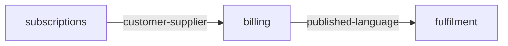

# Subdomains & bounded contexts — Meal-kit subscription

## In plain words

We cut the system into three parts, each one place where a word keeps a single meaning.

**Decided:** Three parts: subscriptions (what you want), billing (what you pay), fulfilment (what gets packed).

**Assumed:** 'Week' means the same thing everywhere. If billing and fulfilment ever count weeks differently, that is a new boundary.

**Riskiest:** A wrong cut is the most expensive mistake here: it is baked into teams, deployables and every contract after it.

---

(fixture: see decompose.json)
