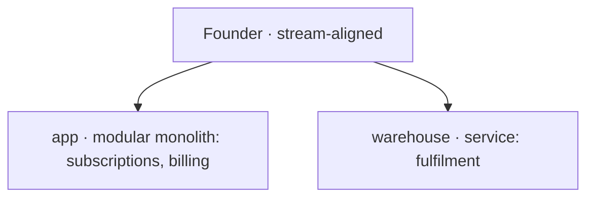

# Team topology — Meal-kit subscription

## In plain words

We decided who owns what, and how many separate things get deployed.

**Decided:** One person owns everything. Two deployables: the app (subscriptions and billing together) and the warehouse.

**Assumed:** Subscriptions and billing can live in one app. They change together and one person runs both.

**Riskiest:** That pairing is why one message below needs no contract. Split them later and it becomes a real seam that does.

---

(fixture: see organise.json)
