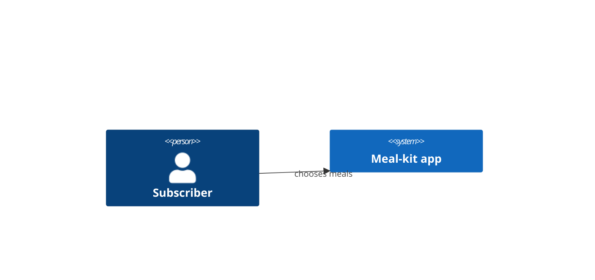

# System context — Meal-kit subscription

## In plain words

We wrote one page per part: what it is for, what it decides, and how we would know it is healthy.

**Decided:** Three pages. Each names the rules it enforces and the words it owns.

**Assumed:** The cutoff time is a business rule that lives in subscriptions and nowhere else.

**Riskiest:** If the cutoff is really a fulfilment rule (when the warehouse must know), it is written in the wrong place.

---

<!-- generated by ddd define render from ddd/07-define/define.json on 2026-08-30T17:55:02Z. Edit define.json and re-render; delete this line to protect hand edits. -->

Weekly meal kits delivered to subscribers. C4 level 1: the system as a single box, the people who use it and the external systems it depends on. No technology or internal structure here — that lives in the bounded context canvases and in `ddd-code`.

## People and external systems

| Party | Type | Sends to the system | Receives from the system |
|---|---|---|---|
| Subscriber (`subscriber`) | person | choose-meals → `subscriptions` | — |

## Bounded contexts and deployables

_Topology_: few-services, 2 deployable(s), 1 team(s).

| Context | Purpose | Domain | Roles | Team | Deployable | Canvas |
|---|---|---|---|---|---|---|
| **Subscriptions** (`subscriptions`) | Subscriptions decides which meals each household receives each week and keeps the standing order alive: it opens, pauses and cancels subscriptions and locks a … | core | execution-context | Founder | Meal-kit app (modular-monolith) | [subscriptions/bounded-context-canvas.md](subscriptions/bounded-context-canvas.md) |
| **Billing** (`billing`) | Billing takes the money for a chosen week: whenever meals are chosen it charges the household's card through Stripe and tells the rest of the system the week i… | generic | execution-context | Founder | Meal-kit app (modular-monolith) | [billing/bounded-context-canvas.md](billing/bounded-context-canvas.md) |
| **Fulfilment** (`fulfilment`) | Fulfilment turns a paid week into a physical box: it builds the picking list, packs the box in the warehouse and hands it to the courier with tracking, so the … | supporting | execution-context | Founder | Warehouse service (service) | [fulfilment/bounded-context-canvas.md](fulfilment/bounded-context-canvas.md) |

### Context relationships (from decompose)

| Id | Upstream | Downstream | Pattern | Why |
|---|---|---|---|---|
| R1 | `subscriptions` | `billing` | customer-supplier | Billing charges on meals chosen |
| R2 | `billing` | `fulfilment` | published-language | Fulfilment packs once charged |

## Quality attributes (Quality Storming, light)

| Context | Attribute | Priority | Requirement | Scenario |
|---|---|---|---|---|
| `subscriptions` | consistency | high | A week is chosen at most once | Double submit |

_Constraints these trace to (understand)_: C1 [regulatory] Food safety labelling

## Open questions and assumptions (this step)

- Assumption A1 (high): Example fixture; assumptions are illustrative
- Question Q1 (owner: domain expert): Illustrative open question

---
_Notation: C4 model level 1 (c4model.com); rendered with Mermaid `C4Context`. Persons are people, `System_Ext` are systems outside our control._
