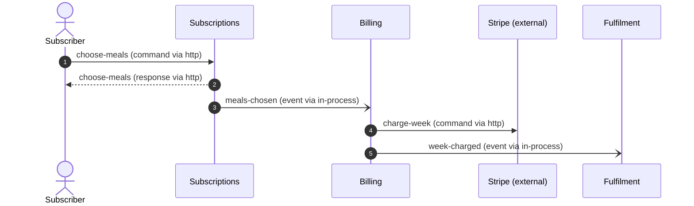

# `message-flows.md` — template and the JSON that produces it

> **Paths:** `${CLAUDE_PLUGIN_ROOT}` below means this plugin's install directory — the absolute
> path already resolved in the SKILL.md that sent you here. Supporting files like this one are
> read raw, so substitute that path yourself; never paste the literal token into a shell.


`ddd/05-connect/message-flows.md` is **rendered** from `connect.json` by
`node ${CLAUDE_PLUGIN_ROOT}/shared/bin/ddd.mjs connect render <ddd-dir> --write-md`. Author the JSON
(including the optional narrative keys below), run the renderer, and the Markdown comes out in this shape.
Do not hand-write the mermaid; `--write-mermaid` fills `flows[].mermaid` from `flows[].steps`.

If a human has hand-edited `message-flows.md` since the last render (re-runs), reconcile first: interactive →
ask which wins; auto → trust the Markdown, update the JSON to match, then re-render (contract §7).

## Rendered structure

```markdown
# Message flows — <manifest.title>
_Step 5 of the DDD chain (connect) · produced <produced_at> · mode <mode> · depth <depth> · inputs: …_
**Scale target:** <min>–<max> deployables, <teams> team(s) — <notes>. …

## How to read the diagrams            ← legend: ->> sync, -) async, -->> response, opt …

## Parties declared in this step        ← only when connect.json has parties[] (contract §4.5)

## Flows
### F1 — <name> (scenario S1: <scenario name>)      ← or "(no discover scenario — derived flow)"
<flows[].summary>
Policies realised: <flows[].policies>

| # | From | To | Message | Kind | Sync | Via |         ← one row per step
Failure paths: …                                        ← flows[].failure_paths (deep)
<flows[].notes>

## Message catalogue
| Message | Kind | Producer | Consumers | Payload | Delivery | Contract type | Notes |
| `meals-chosen` | event | subscriptions | billing | subscriptionId, week, recipeIds | at-least-once | customer-supplier | v1; idempotency: … |

## Integration decisions (one per context-map relationship)
| Relationship | Upstream → downstream | Pattern | Mechanism | Assumed distance | Rationale |

## Long-running processes (sagas / process managers)   ← only when connect.json has sagas[] (deep)

## Coupling concerns
- **CC1** (medium) — <text> — contexts: a, b — smell: …; flows: F1; mitigation: …

## Deprecated                                          ← only when connect.json has deprecated[] (re-runs)

## Assumptions
## Open questions
---
Next step: `/ddd-organise` …
```

## `connect.json` skeleton (contract §4.5 + envelope §3 + the optional keys the renderer understands)

```json
{
  "schema_version": 1,
  "step": "connect",
  "produced_by": "ddd-connect",
  "produced_at": "2026-08-29T19:45:00Z",
  "mode": "auto",
  "depth": "light",
  "inputs": ["ddd/03-decompose/decompose.json", "ddd/04-strategize/strategize.json",
             "ddd/02-discover/discover.json", "ddd/manifest.json"],
  "assumptions": [
    { "id": "A1", "text": "All three contexts start in one deployable (scale target 1–3); fulfilment may be split later", "confidence": "medium" }
  ],
  "open_questions": [
    { "id": "Q1", "text": "When a card is declined after meals are chosen, do we retry, skip the week, or pause the subscription?", "blocking": false, "owner": "product owner" }
  ],
  "flows": [
    {
      "id": "F1", "name": "Weekly box — happy path", "scenario": "S1", "kind": "happy-path",
      "summary": "The subscriber locks in the week's meals; billing charges; fulfilment packs and ships.",
      "policies": ["charge-on-choice", "pack-on-charge"],
      "steps": [
        { "seq": 1, "from": "subscriber",    "to": "subscriptions", "message": "choose-meals", "kind": "command",  "sync": true,  "via": "http" },
        { "seq": 2, "from": "subscriptions", "to": "subscriber",    "message": "choose-meals", "kind": "response", "sync": true,  "via": "http" },
        { "seq": 3, "from": "subscriptions", "to": "billing",       "message": "meals-chosen", "kind": "event",    "sync": false, "via": "in-process" },
        { "seq": 4, "from": "billing",       "to": "stripe",        "message": "charge-week",  "kind": "command",  "sync": true,  "via": "http", "note": "outside any DB transaction; outcome recorded after" },
        { "seq": 5, "from": "billing",       "to": "fulfilment",    "message": "week-charged", "kind": "event",    "sync": false, "via": "in-process" }
      ],
      "mermaid": "(filled by ddd connect render --write-mermaid)"
    }
  ],
  "messages": [
    { "id": "choose-meals", "kind": "command", "producer": "subscriber", "consumers": ["subscriptions"],
      "contract": "ui", "payload": ["subscriptionId", "week", "recipeIds"], "delivery": "sync",
      "response_payload": ["confirmation", "cutoffAt"] },
    { "id": "meals-chosen", "kind": "event", "producer": "subscriptions", "consumers": ["billing"],
      "contract": "customer-supplier", "payload": ["subscriptionId", "week", "recipeIds", "priceTotal", "currency"],
      "delivery": "at-least-once", "idempotency": "billing de-duplicates on (subscriptionId, week)", "version": "1" },
    { "id": "charge-week", "kind": "command", "producer": "billing", "consumers": ["stripe"],
      "contract": "external-api", "payload": ["customerToken", "amount", "currency", "idempotencyKey"], "delivery": "sync" },
    { "id": "week-charged", "kind": "event", "producer": "billing", "consumers": ["fulfilment"],
      "contract": "published-language", "payload": ["subscriptionId", "week", "chargedAt"],
      "delivery": "at-least-once", "idempotency": "fulfilment creates at most one box per (subscriptionId, week)", "version": "1" }
  ],
  "integration_patterns": [
    { "relationship": "R1", "mechanism": "in-process-call", "assumed_distance": "same-deployable",
      "rationale": "Billing is a thin Stripe wrapper in the same app; in-memory domain event, at-least-once via an outbox table because a lost charge is money" },
    { "relationship": "R2", "mechanism": "async-events", "assumed_distance": "separate-deployable",
      "rationale": "Fulfilment runs on-site with different uptime; it only needs the week-charged fact" }
  ],
  "coupling_concerns": [
    { "id": "CC1", "text": "Fulfilment needs recipe names/portions for the picking list, owned by Subscriptions", "contexts": ["subscriptions", "fulfilment"],
      "severity": "medium", "smell": "data-hungry", "flows": ["F1"], "mitigation": "replicate a picking read model from meals-chosen" }
  ],
  "sagas": []
}
```

Notes on the optional keys (all ignored by `ddd validate`, all rendered):

- `flows[].kind`: `happy-path` | `alternative` | `policy` | `failure`; `flows[].summary`, `flows[].notes`,
  `flows[].policies` (discover policy ids realised), `flows[].failure_paths` (strings; deep).
- `steps[].note` (rendered as a Mermaid note), `steps[].when` (consecutive steps with the same `when`
  are wrapped in `opt <when>`).
- `messages[].name`, `description`, `idempotency`, `version`, `response_payload`.
- `messages[].channels[]` — a secondary channel when one message travels two ways: `{ "via": "file", "sync": false,
  "delivery": "at-least-once", "note": "nightly manifest" }`; the primary channel stays in `delivery` and the steps' `via`.
- `parties[]` (top level; contract §4.5, checked by the validator, which warns until discover adopts them) — a party
  discover never named: `{ "id": "depot", "name": "Courier depot", "kind": "external-system", "description": "…" }`.
- `coupling_concerns[].saga_candidate: true` — a long-running / compensating flow flagged at standard or light depth
  (deep designs it in `sagas[]`).
- `integration_patterns[].assumed_distance` (`same-deployable` | `separate-deployable`), `integration`
  (`none` for separate-ways).
- `coupling_concerns[].smell` (id from `coupling-smells.md`), `flows`, `mitigation`.
- `sagas[]` (deep): `{ "id": "SG1", "name", "style": "choreography|orchestration", "owner": "<context>",
  "trigger": "<event id>", "steps": ["…"], "compensations": ["…"], "timeouts": "…" }`.
- `deprecated[]` (envelope, re-runs only; in the shared schema): `{ "id": "F3", "collection": "flows|messages|coupling_concerns|integration_patterns|sagas",
  "reason": "…", "since": "<produced_at>" }` — rendered as a "Deprecated" section so reviewers see what went away.
