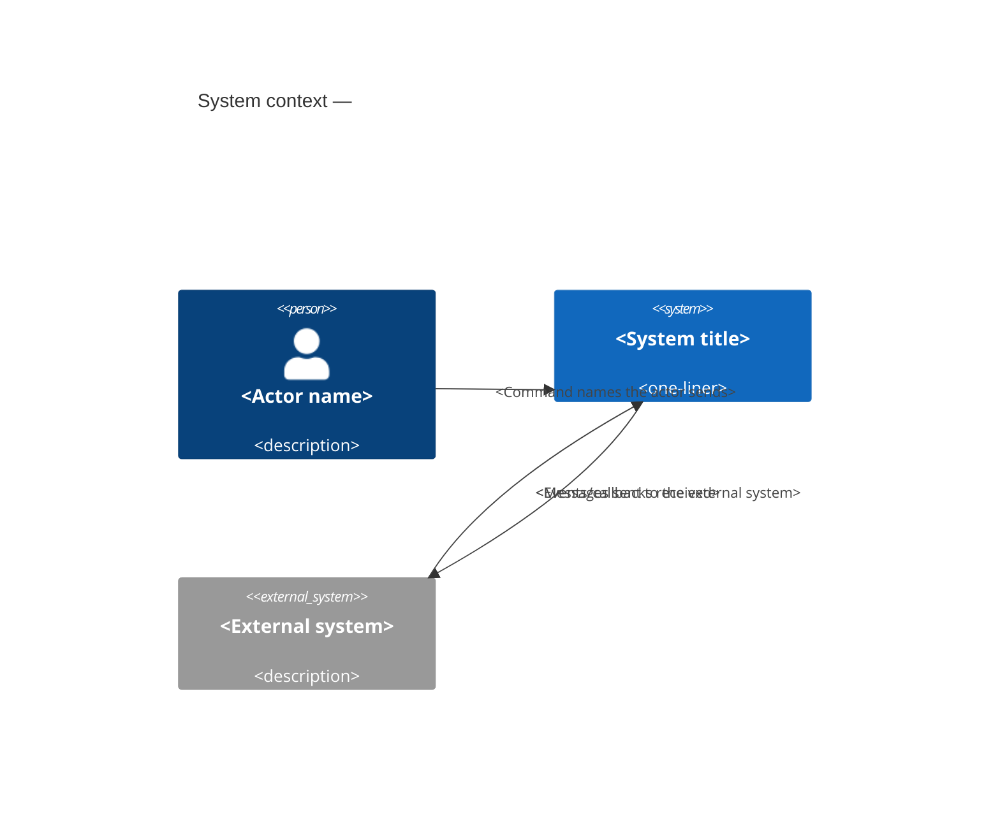

# System context — <System title>

<!-- generated by ddd define render from ddd/07-define/define.json on <ISO date>. Edit define.json and re-render; delete this line to protect hand edits. -->

<one-liner from understand.system>. C4 level 1: the system as a single box, the people who use it and the external systems it depends on. No technology or internal structure here — that lives in the bounded context canvases and in `ddd-code`.

## People and external systems

| Party | Type | Sends to the system | Receives from the system |
|---|---|---|---|
| <Name> (`<id>`) | person / external system | <Message Name> → `<context>` | <Message Name> ← `<context>` |

## Bounded contexts and deployables

_Topology_: <modular-monolith / few-services / many-services>, <n> deployable(s), <n> team(s).

| Context | Purpose | Domain | Roles | Team | Deployable | Canvas |
|---|---|---|---|---|---|---|
| **<Name>** (`<id>`) | <first sentence of the purpose> | core / supporting / generic | <roles> | <team> | <deployable> (<kind>) | [<id>/bounded-context-canvas.md](<id>/bounded-context-canvas.md) |

### Context relationships (from decompose)

| Id | Upstream | Downstream | Pattern | Why |
|---|---|---|---|---|
| R1 | `<ctx>` | `<ctx>` | customer-supplier / published-language / … | <description> |

## Quality attributes (Quality Storming, light)

| Context | Attribute | Priority | Requirement | Scenario |
|---|---|---|---|---|
| `<ctx>` | <attribute> | high / medium / low | <measurable requirement> | <when → then, with a measure> |

_Constraints these trace to (understand)_: C1 [regulatory] <text>; …

## Open questions and assumptions (this step)

- Assumption A<n> (<confidence>): <text>
- Question Q<n> — BLOCKING? (owner: <who>): <text>
- Note N<n> for code (<kind>): <text>

---
_Notation: C4 model level 1 (c4model.com); rendered with Mermaid `C4Context`. Persons are people, `System_Ext` are systems outside our control._
