# `ddd/02-discover/event-storm.md` — what the rendered board looks like

`ddd discover render <ddd-dir>/02-discover/discover.json` writes this file from the JSON.
Do not hand-write it: the JSON is the chain, and a hand-written board
drifts from it within one edit. This page exists so you know what to expect, can review the output
quickly, and can reproduce the structure if you ever must write it by hand.

## Section order (fixed)

1. `# Event storm - <project title>` + one line of envelope facts (step, producer, mode, depth,
   `produced_at`) + `_Inputs: …_` + the "rendered from JSON" notice.
2. `## How to read this board` — the sticky legend for readers who have never seen an event storm.
3. `## Summary` — counts (events/phases/pivotal, commands/policies/read models/actors/externals/
   aggregates, hotspots/scenarios/glossary/assumptions/open questions) and the depth band.
4. `## Timeline` — the phase spine (`1. Subscribing -> 2. Choosing meals -> 3. Fulfilling`), then
   one `### Phase n - <name>` per phase with the table below and the hotspots that sit in it.
   Above 40 events (or `--split always`) each phase also gets its own mermaid diagram.
5. `## Board (mermaid)` — one flowchart with a subgraph per phase (omitted when split per phase).
6. `## Actors`, `## External systems`, `## Commands`, `## Policies`, `## Read models`,
   `## Aggregate candidates` (when present), `## Pivotal events`, `## Hotspots`, `## Scenarios`
   (a scenario with `loops: true` is marked *(loops)*), `## Glossary seed`, `## Assumptions`,
   `## Open questions`, `## Notes for downstream` (one line per `notes_for_downstream[]` entry:
   `- **N1** (language -> decompose, define): <text>`; "(none)" when empty), `## Deprecated` (when present).

## The phase table

| # | Event | Triggered by | Actor | Read model | Whenever this, then | Notes |
|---|---|---|---|---|---|---|
| 20 | **Meals Chosen** `meals-chosen` | Choose Meals `choose-meals` | Subscriber | Weekly menu | Charge Week | Weekly choice locked in - data: subscriptionId, week, recipeIds |
| 25 | **Week Charged** [H1] `week-charged` | Charge Week `charge-week` | Stripe |  | Pack Box | Payment taken - data: subscriptionId, week, amount |

- `#` is `events[].sequence` (global, gaps of 10).
- **Event** carries `(pivotal)` when the event is in `pivotal_events[]` and `[H1]` for every hotspot
  whose `near` is this event; the id follows in backticks because downstream steps use ids.
- **Triggered by** is the command (`triggered_by`), `external: <system>` for a fact reported by an
  external system with no command, or `(no command)` — the last one is a defect to fix.
- **Actor** is the event's actor, falling back to the command's actor.
- **Read model** lists read models whose `informs` is that command.
- **Whenever this, then** lists the `then` commands of every policy whose `when` is this event
  (`(manual)` appended for manual policies).
- **Notes** is `description` plus `data: …`.

Hotspots in the phase follow as a list: `- **H1** (unclear, near \`week-charged\`): <text>`.

## The mermaid board

```mermaid
flowchart LR
  classDef event fill:#F6A623,stroke:#8A5A00,color:#000
  classDef pivotal fill:#F6A623,stroke:#000,stroke-width:3px,color:#000
  classDef command fill:#8FB8FF,stroke:#1F4E9C,color:#000
  classDef policy fill:#C9A7EB,stroke:#5B2D8E,color:#000
  classDef readmodel fill:#9EDF9C,stroke:#2E7D32,color:#000
  classDef hotspot fill:#FF3B8D,stroke:#8B0040,color:#fff
  classDef external fill:#F8C6DF,stroke:#A3325F,color:#000
  subgraph ph_choosing["2 - Choosing meals"]
    direction LR
    e_meals_chosen["Meals Chosen"]:::event
    c_choose_meals["Subscriber<br/>Choose Meals"]:::command
    r_weekly_menu(["Weekly menu"]):::readmodel
    p_charge_on_choice{{"Whenever meals chosen, charge the week"}}:::policy
    e_week_charged["Week Charged"]:::event
    c_charge_week["Charge Week"]:::command
    h_H1>"H1: What happens if payment fails after meals are chosen?"]:::hotspot
  end
  r_weekly_menu -.-> c_choose_meals
  c_choose_meals --> e_meals_chosen
  e_meals_chosen --> p_charge_on_choice
  p_charge_on_choice --> c_charge_week
  c_charge_week --> e_week_charged
  e_week_charged -.- h_H1
  e_meals_chosen ~~~ e_week_charged
```

Conventions: node ids are `e_`/`c_`/`p_`/`r_`/`h_`/`x_` + the JSON id with non-alphanumerics
replaced by `_`; labels are quoted and stripped of `{}<>|#;` and double quotes; consecutive
events in a phase are joined by invisible links (`~~~`) so the layout keeps timeline order; a
policy whose `then` command lives in another phase gets a stub node (`Pack Box -> Fulfilling`) in
per-phase diagrams. The sticky colours follow the ddd-crew cheat sheet.

## If you must write it by hand

Keep the section order above, the phase-table columns, and the id-in-backticks convention — the
reviewers and the next skills scan for them. Then run `ddd discover render` as soon as you
can and diff: the JSON wins on any disagreement.
