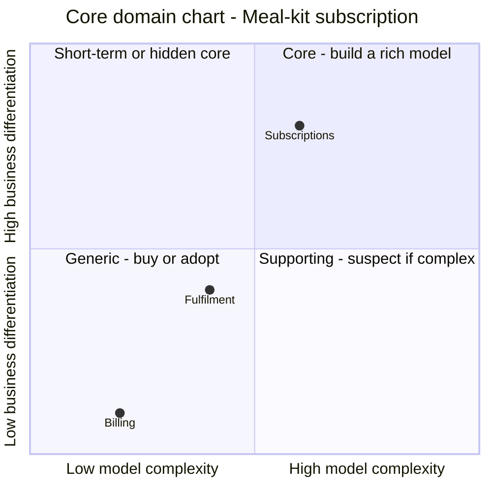

# Template — `ddd/04-strategize/core-domain-chart.md`

`ddd strategize render` produces this file from `strategize.json` so the Markdown can never
disagree with the JSON (contract §7: the JSON is the chain). Every narrative section is a JSON key;
if you want more prose in the Markdown, put it in the key and re-render. The layout below is what
the command emits; write it by hand only if Node is unavailable.

Optional JSON keys the renderer picks up (all top-level unless noted):

| Key | Rendered as | Depth |
|---|---|---|
| `summary` (string, 2–4 sentences) | paragraph under the heading | standard, deep |
| `investment_summary` (string) | *Investment* section body (else auto-generated) | standard, deep |
| `classifications[].purpose_alignment` (`differentiating` / `parity` / `partner` / `who-cares`) | *Purpose alignment* table | deep |
| `classifications[].chart_pattern` (e.g. `decisive-core`, `short-term-core`, `hidden-core`, `big-bet-core`, `table-stakes-former-core`, `commoditised-core`, `suspect-supporting`) | column in the rationale table | deep |
| `wardley_narrative` (string) | *Wardley narrative* section | deep |
| `bets[].subdomains`, `bets[].validate_by` | bet bullet details | standard, deep |
| `classifications[].goal_ids` (list of `G*`; `[]` = none applies) | appended to the rationale cell as _Goals:_; lint reads it instead of the prose | all |
| `classifications[].history_is_asset` (`true`/`false`) | not rendered; lint uses it to justify `event-sourced-domain-model` | all |
| `classifications[].evolution_rationale` (string) | appended to the rationale cell as _Evolution:_ | standard, deep |
| `notes_for_downstream` (envelope, `{id, text, for, kind}`) | *Notes for downstream* section | when present |
| `deprecated` (list of `{subdomain, reason}`) | *Deprecated* section | re-runs |

## Layout

```markdown
# Core domain chart — <manifest.title or understand.system.name>

_Step 4 of 9 (`ddd-strategize`) · mode `<mode>` · depth `<depth>` · produced `<produced_at>`_

**Where to invest:** core → `subscriptions`; supporting → `fulfilment`; generic (buy) → `billing`.

<summary>

## Chart



Axes: x = model complexity (score/10), y = business differentiation (score/10). Top-right is the
core; bottom-left is generic; a supporting subdomain far to the right is "suspect" (accidental
complexity or a core in disguise). Points nudged by ≤ 0.01 for legibility (`…`); the table below holds the true scores.

## Classifications

| Subdomain | Type | Diff | Cplx | Evolution | Sourcing | Pattern | Investment | Context(s) |
|---|---|---|---|---|---|---|---|---|
| Subscriptions (`subscriptions`) | **core** | 8 | 6 | custom | build | domain-model | high | `subscriptions` |
| Billing (`billing`) | generic | 1 | 2 | commodity | buy | transaction-script | low | `billing` |
| Fulfilment (`fulfilment`) | supporting | 4 | 4 | product | build | active-record | medium | `fulfilment` |

## Rationale and future direction

| Subdomain | Rationale | Future direction |
|---|---|---|
| `subscriptions` | core — G1 (10k active subscribers) depends on … | stays core; watch for choice UX becoming table stakes |
| … | … | … |

## Investment

<investment_summary, or auto text: "High: subscriptions. Medium: fulfilment. Low: billing." plus the
rule "best people and modelling time go to the core; supporting stays simple; generic is integration only">

## Bets

- **B1** — Choice UX drives retention. _Risk:_ unvalidated. _Validate by:_ week-4 retention ≥ 70 %. _Subdomains:_ `subscriptions`

## Purpose alignment   (deep only)

| Subdomain | Quadrant | Type |
|---|---|---|

## Wardley narrative   (deep only)

<wardley_narrative>

## Assumptions

- **A1** (medium) — …

## Open questions

- **Q1** — … _(blocking: no; owner: domain expert)_

## Hand-off

- `ddd-connect`: integration effort follows investment — protect the core with an ACL where a bought/generic context is upstream of a built one: `billing` → `fulfilment` (R2). Adapters inside built contexts (an ACL around the vendor, not a context relationship): none
- `ddd-organise`: the core gets the strongest, most stable team; generic contexts need integrators only
- `ddd-define`: strategic classification per context (a context takes its most demanding subdomain): `subscriptions` = core; `billing` = generic; `fulfilment` = supporting
- `ddd-code`: aggregates only for contexts on a domain model: `subscriptions` (domain-model); `billing`, `fulfilment` get application services and a design.md only
```

## Rules the renderer enforces

- Point labels: letters, digits, spaces and hyphens only (the mermaid quadrant grammar rejects
  colons and brackets in labels); names are sanitised. Coincident points are nudged by at most 0.01
  (0.1 on the 0–10 scale) and the chart caption says which; the tables always show the true scores.
- Coordinates are clamped to 0.02–0.98 so edge labels are not clipped.
- Plain points by default; `--styled` adds `:::core` / `:::supporting` / `:::generic` classes with
  `classDef` colours (needs a mermaid that supports point styling).
- Table cells escape `|` and newlines.
- The `Hand-off` section is derived, not authored. A bounded context takes the type and pattern of
  its *most demanding* hosted subdomain (core > supporting > generic; event-sourced > domain-model >
  active-record > transaction-script — implementation-patterns.md §4). ACLs are listed only where a
  wholly bought/generic context is upstream of a built one; a generic or bought subdomain hosted inside
  a built context is listed as "ACL inside `<context>` around <vendor>" (vendor from its events'
  external-system actors, the context's `wraps`, or a matching `existing_systems` entry).
- `--update-json` also stamps `produced_at`, so it is the last thing run after any JSON edit.
