# Mermaid Diagram Policy

This document defines the rules and best practices for Mermaid diagrams in wiki documentation.

## Diagram Types

| Type | Use Case | Syntax |
|------|----------|--------|
| `flowchart` | Process flows, data flow, decision trees | `graph TD` |
| `sequence` | Interaction sequences, API calls | `sequenceDiagram` |
| `class` | Class relationships, inheritance | `classDiagram` |
| `state` | State machines, status transitions | `stateDiagram-v2` |
| `er` | Entity relationships, database schema | `erDiagram` |
| `gantt` | Project timelines | `gantt` |

## Diagram Density (MANDATORY)

Diagrams are not decoration — they are the fastest path to comprehension. Pages
that are walls of prose fail review.

| Page scope | Minimum diagrams | Minimum distinct types |
|------------|------------------|------------------------|
| Small | 3 | 2 |
| Medium | 4 | 2 (3+ preferred) |
| Large / complex | 5+ | 2 (4+ preferred) |

Rules:

- **Minimum 3 diagrams per page**, scaled by scope as above. More is better —
  aim for roughly one diagram per major section.
- **Use at least 2 DIFFERENT diagram types per page.** Never repeat the same
  type for every diagram. Mix `graph`, `sequenceDiagram`, `classDiagram`,
  `stateDiagram-v2`, `erDiagram`, `flowchart` as the content warrants.

## Diagram Selection Heuristic

Pick the type from what you are explaining, not from habit:

| You are explaining... | Use |
|-----------------------|-----|
| **Structure** — components, modules, dependencies, layers | `graph TD` |
| **Behavior** — interactions over time, request lifecycles | `sequenceDiagram` |
| **Behavior** — lifecycle, status transitions | `stateDiagram-v2` |
| **Data** — entities, tables, relationships | `erDiagram` |
| **Decisions** — branching logic, error paths, pipelines | `flowchart` |
| **Types** — class hierarchies, interfaces, domain models | `classDiagram` |

## Critical Rules

### Rule 1: Use Vertical Orientation

**Always use `graph TD` (top-down), never `graph LR` (left-right).**

`graph LR` renders wide and scrolls badly on narrow pages. The linter accepts
`LR` but emits a `horizontal_orientation` warning; this policy is stricter than
the linter — treat `LR` as a defect and rewrite it as `TD`.

### Rule 2: Quote All Node Text

**All node text must be wrapped in double quotes.**

#### CORRECT
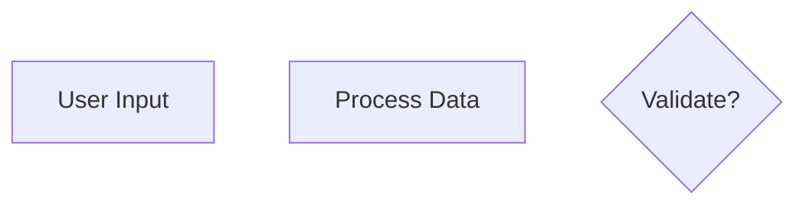

#### WRONG - Missing quotes cause parse errors


This applies to ALL node types:
- Rectangles: `A["text"]`
- Rounded: `B("text")`
- Circles: `C(("text"))`
- Diamonds: `D{"text"}`
- Hexagons: `E{{"text"}}`

### Rule 3: Subgraph Names - No Special Characters

**Subgraph names must NOT contain parentheses or special characters.**

#### CORRECT
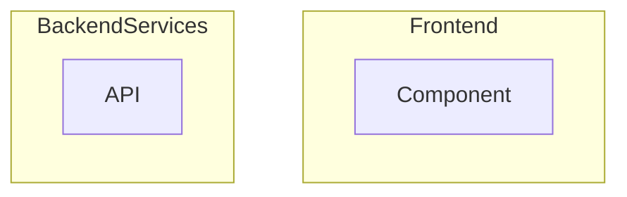

#### WRONG - Parentheses in subgraph name
```mermaid
graph TD
    subgraph Frontend(React)
        A["Component"]
    end
```

Use alphanumeric characters and underscores only.

### Rule 4: Sequence Diagram Messages - Never Empty

**The colon in sequence diagrams must be followed by content.**

#### CORRECT
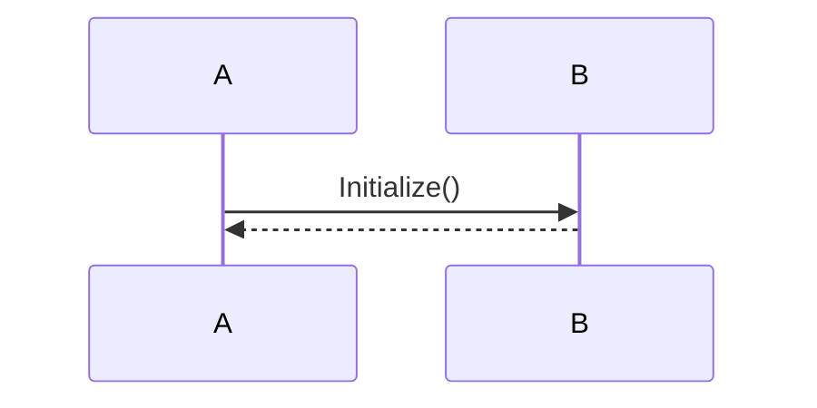

#### WRONG - Empty message
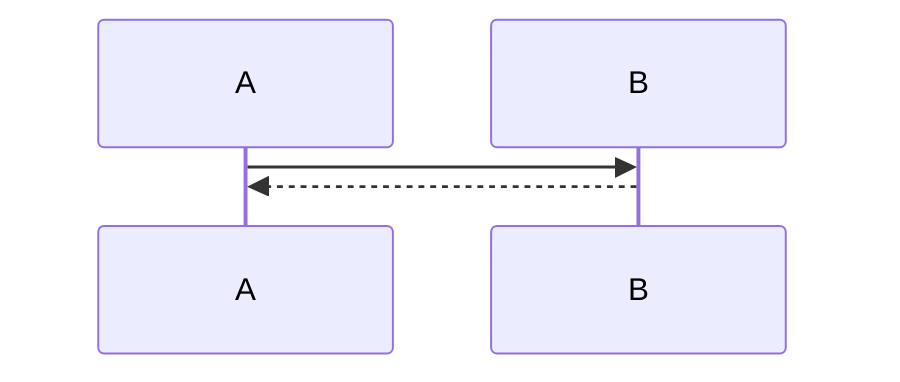

When there's no meaningful message, use `;` as placeholder.

### Rule 5: No Shorthand Activation

**Do NOT use shorthand activation syntax (`->>+`, `-->>-`).**

#### CORRECT
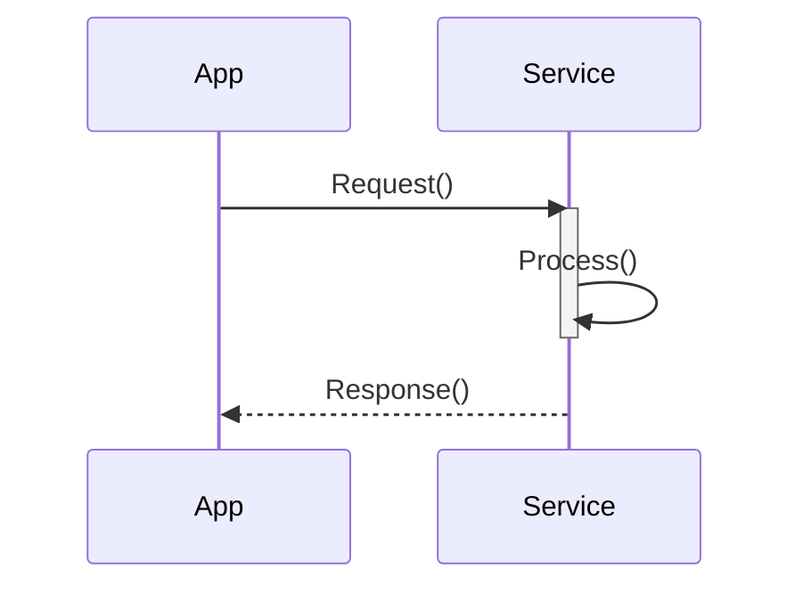

#### WRONG - Shorthand activation
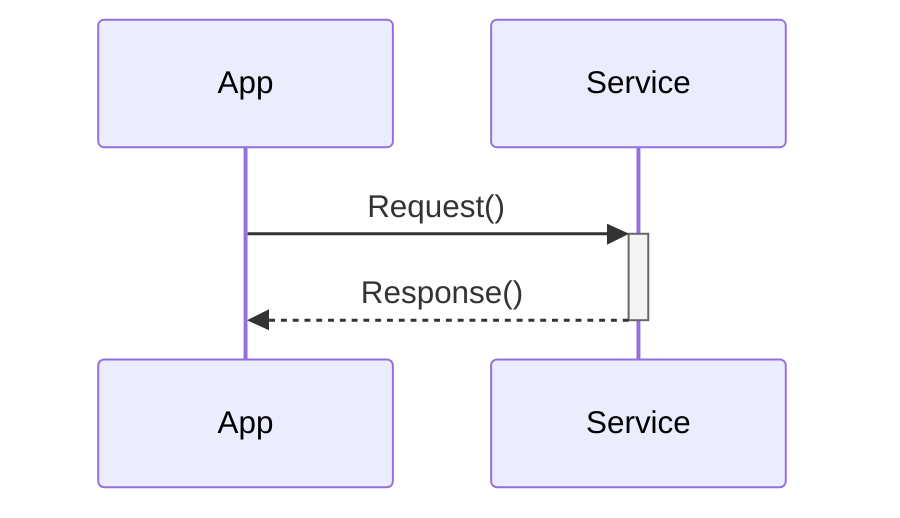

### Rule 6: No Source Citations INSIDE Diagrams

**Never include source file citations inside Mermaid diagrams.**

#### CORRECT
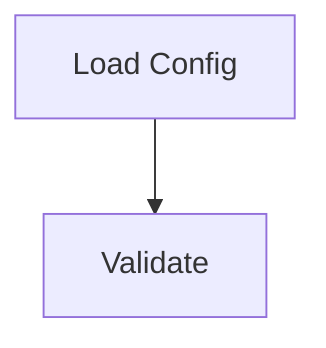

#### WRONG - Citation in diagram
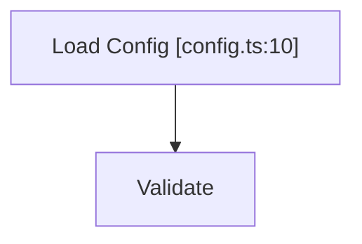

Citations belong outside the diagram — in the documentation text and in the
`<!-- Sources: ... -->` comment block required by Rule 7. Note that citation
brackets inside an unquoted label are also a hard parse error
(`unquoted_node_label`), so this rule is enforced by the linter as well as by
policy.

### Rule 7: Sources Comment Block Under Every Diagram

**Every Mermaid block must be immediately followed by a `<!-- Sources: ... -->`
comment listing the files the diagram was derived from.**

This satisfies Rule 6 (nothing inside the diagram) while keeping every diagram
evidence-backed. It goes *after* the closing fence, never inside it.

#### CORRECT
````markdown
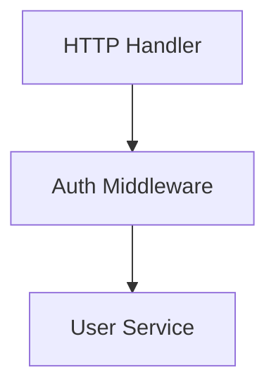
<!-- Sources: src/server/handler.ts:20-48, src/middleware/auth.ts:12-60 -->
````

A diagram with no `<!-- Sources: ... -->` block is an incomplete diagram.

### Rule 8: Always Use `autonumber` in Sequence Diagrams

**Every `sequenceDiagram` block must declare `autonumber` on the line directly
after the diagram header.**

Numbered steps let prose reference individual messages ("step 3 validates the
token") instead of describing them again.

#### CORRECT
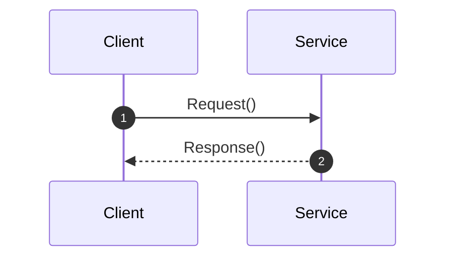

The linter reports a missing `autonumber` as a `missing_autonumber` warning.

### Rule 9: Prefer `<br>` Over `<br/>`

**Use `<br>` for line breaks in labels. Never use `<br/>` or `<br />`.**

Self-closing break tags can break Mermaid parsing and are rejected by some
renderers. The linter reports them as a `br_self_closing` warning.

#### CORRECT
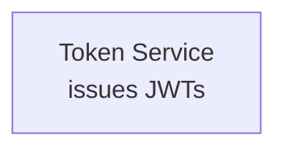

#### WRONG


## Dark-Mode Color Mandate

**All diagrams are authored for dark-theme rendering.** Light fills are
unreadable against the dark backgrounds the wiki is rendered on.

| Element | Property | Value |
|---------|----------|-------|
| Node | fill | `#2d333b` |
| Node | border / stroke | `#6d5dfc` |
| Node | text / color | `#e6edf3` |
| Subgraph | background | `#161b22` |
| Subgraph | border / stroke | `#30363d` |
| Lines / edges | stroke | `#8b949e` |

Rules:

- **If you use an inline `style` directive, you MUST include `,color:#e6edf3`.**
  Setting a dark fill without setting the text color leaves dark text on a dark
  node — invisible.
- Never use light fills (`#fff`, `#ffffff`, `#eee`, `white`, `lightgrey`, ...).
  The linter reports these as a `light_mode_fill` warning.
- All hex colors must be 3 or 6 digits — never 4 or 5.

#### CORRECT
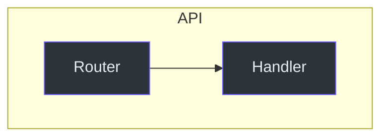

#### WRONG - light fill, and no text color
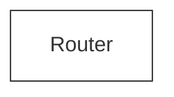

## Language-Specific Text

**Node labels should be in the target language (default: `en-US`).**

The locale is read from the TOC `project.language` field; `en-US` is only the
default when none is set. Node labels, edge labels and notes must all be written
in that language.

#### For English output (default)
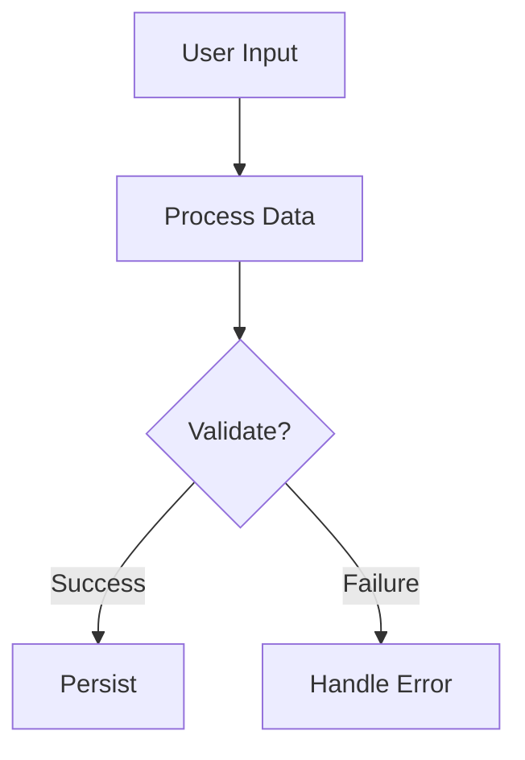

#### For a non-English locale (e.g. `ja-JP`)
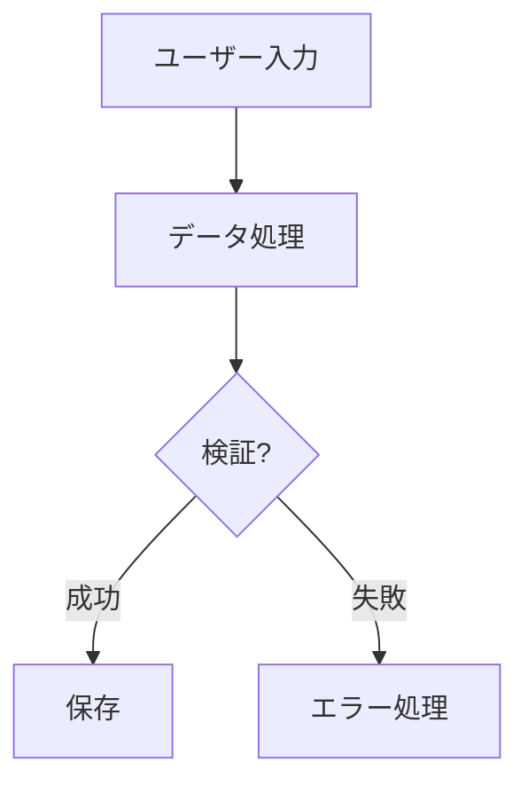

## Flowchart Best Practices

### Node Style

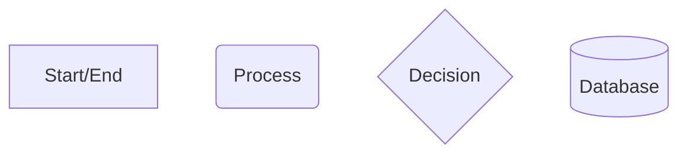

### Edge Labels

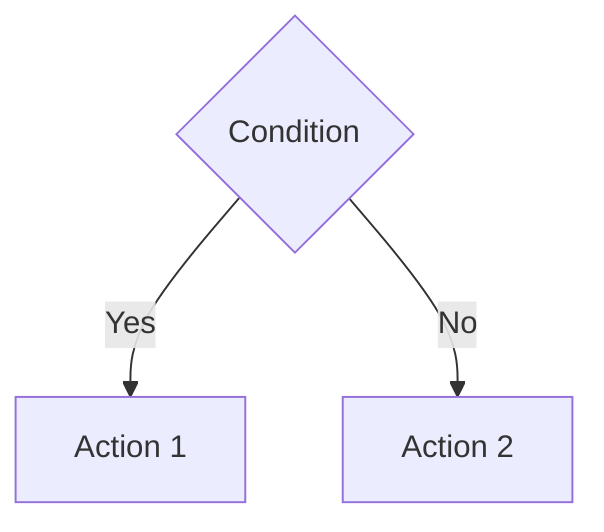

### Keep It Simple

- Maximum 10-15 nodes per diagram
- 3-4 words per node label
- Avoid crossing lines when possible

## Sequence Diagram Best Practices

### Participant Aliases

```mermaid
sequenceDiagram
    autonumber
    participant U as User
    participant A as API
    participant D as Database

    U->>A: Request Data
    A->>D: Query
    D-->>A: Results
    A-->>U: Response
```

### Activation Boxes

```mermaid
sequenceDiagram
    autonumber
    participant Client
    participant Server

    Client->>Server: POST /api/data
    activate Server
    Server->>Server: Validate
    Server->>Server: Process
    deactivate Server
    Server-->>Client: 200 OK
```

### Notes

```mermaid
sequenceDiagram
    autonumber
    participant A
    participant B

    Note over A,B: Authentication Flow
    A->>B: Login Request
    Note right of B: Validate credentials
    B-->>A: Token
```

## Class Diagram Best Practices

```mermaid
classDiagram
    class User {
        +String name
        +String email
        +login()
        +logout()
    }

    class Admin {
        +String role
        +manage()
    }

    User <|-- Admin : extends
```

## State Diagram Best Practices

```mermaid
stateDiagram-v2
    [*] --> Idle
    Idle --> Processing : start
    Processing --> Complete : success
    Processing --> Error : failure
    Complete --> [*]
    Error --> Idle : retry
```

## Validation Process

### 1. Run the Linter

Validation is performed by `scripts/validate_mermaid.py`.

**Zero dependencies.** It is a pure-stdlib Python linter. There is nothing to
install — no Node.js, no npm, no `mermaid-cli`, no `pip install`. Mermaid is
rendered natively by GitHub, GitLab and VitePress, so no local renderer is
needed; the only thing a local tool usefully adds is a syntax check, and that is
all this script does.

```bash
python3 ${CLAUDE_PLUGIN_ROOT}/skills/deepwiki/scripts/validate_mermaid.py --input {doc_dir} --invalid-only --output _reports/mermaid_invalid.json
```

Options:

| Option | Purpose |
|--------|---------|
| `--input PATH` | File (`.md`/`.mmd`) or directory to scan |
| `--code CODE` | Validate a Mermaid code string directly |
| `--blocks PATH` | Validate from a pre-extracted blocks JSON file |
| `--output PATH` | Write the JSON report here (default: stdout) |
| `--patterns PATTERNS` | Comma-separated globs for markdown files (default: `*.md`) |
| `--invalid-only` | Emit only the invalid blocks |
| `--extract-only` | Extract blocks without validating |
| `--strict` | Treat policy warnings as errors |

Exit codes: `0` = all valid, `1` = invalid diagrams found, `2` = bad invocation.

**Validation Output Fields**:

| Field | Type | Description |
|-------|------|-------------|
| `is_valid` | boolean | Whether the diagram parses |
| `error_message` | string | Clean error description |
| `error_type` | string | Error category (see below) |
| `error_line` | number | Line number where the error occurred |
| `fix_hint` | string | Suggested fix |
| `diagram_type` | string | Detected type (`flowchart`, `sequence`, `class`, `state`, `er`, ...) |
| `warnings` | array | Policy warnings — see below |

### 2. Errors (hard failures)

An error means the diagram would genuinely fail to parse. These are the complete
set of `error_type` values the linter emits:

| `error_type` | Meaning | Fix |
|--------------|---------|-----|
| `smart_characters` | Curly quotes or a non-breaking space | Replace with plain ASCII punctuation |
| `empty_block` | The ```` ```mermaid ```` block has no content | Add a diagram declaration, e.g. `graph TD` |
| `unknown_diagram_type` | Header is not a recognized diagram keyword | Fix the typo (`flowChart` → `graph`) |
| `missing_direction` | Bare `graph` with no direction | Use `graph TD` |
| `invalid_direction` | Direction is not TD/TB/BT/LR/RL | Use `TD` |
| `unbalanced_quote` | A `"` is opened but never closed | Close the quote |
| `unbalanced_delimiter` | Stray/mismatched `(` `[` `{` `)` `]` `}` | Balance the delimiters |
| `unquoted_node_label` | Unquoted label contains a hard-breaking character | Wrap the label in double quotes |
| `invalid_subgraph_name` | Subgraph name contains special characters | Use alphanumerics, or `subgraph id ["My Title (v2)"]` |
| `reserved_node_id` | Node id is `end`, `graph` or `subgraph` | Rename the node, e.g. `endNode[...]` |
| `unbalanced_end` | `subgraph`/`loop`/`alt`/`opt`/`par`/`rect`/`box` without matching `end`, or a stray `end` | Balance the block |
| `empty_message` | Nothing after the `:` in a sequence / ER / state label | Add text, or `: ;` if intentionally blank |
| `invalid_arrow` | Sequence arrow is not a valid form | Use `->`, `-->`, `->>`, `-->>`, `-x`, `--x`, `-)`, `--)` |

**Which characters actually hard-fail an unquoted label?** Only these:

```
( ) [ ] { } " | ;
```

They collide with shape delimiters, the edge-label delimiter, the statement
separator, or string quoting. Characters like `/ , : < >` parse fine unquoted —
`A[Save/Cancel]` and `A[Retry <br>now]` are valid Mermaid. Policy still requires
quoting **every** label (Rule 2), so those surface as *warnings*, not errors. Do
not claim they are parse failures.

### 3. Warnings (policy nits)

Warnings do not fail a block unless you pass `--strict`. They are the executable
form of this policy document:

| Warning type | Meaning |
|--------------|---------|
| `unquoted_node_label` | Label parses, but Rule 2 requires quoting it |
| `br_self_closing` | `<br/>` or `<br />` used instead of `<br>` (Rule 9) |
| `light_mode_fill` | A light fill was used — unreadable on dark backgrounds |
| `missing_autonumber` | `sequenceDiagram` has no `autonumber` (Rule 8) |
| `multiline_label` | A quoted label spans multiple source lines |
| `horizontal_orientation` | `graph LR` used instead of `graph TD` (Rule 1) |

### 4. Fix and Retry (Max 3 Attempts)

Use `error_type` and `fix_hint` to guide each fix, then re-run the linter.

If validation still fails after 3 attempts:
1. Comment out the diagram
2. Add a TODO marker
3. Record it in the mermaid report

## Common Errors and Fixes

### `unquoted_node_label` — label contains `()[]{}"|;`

**Before**:
```mermaid
graph TD
    A[User (Admin)] --> B
```

**After**:
```mermaid
graph TD
    A["User (Admin)"] --> B
```

### `unbalanced_delimiter` — stray or mismatched bracket

**Before**:
```mermaid
graph TD
    A["Start"} --> B["End"]
```

**After**:
```mermaid
graph TD
    A["Start"] --> B["End"]
```

### `empty_message` — nothing after the `:`

**Before**:
```mermaid
sequenceDiagram
    autonumber
    A->>B:
```

**After**:
```mermaid
sequenceDiagram
    autonumber
    A->>B: Initialize()
```

### `unknown_diagram_type` — header is not a real diagram keyword

**Before**:
```mermaid
sequenceChart
    A->>B: Request()
```

**After**:
```mermaid
sequenceDiagram
    autonumber
    A->>B: Request()
```

(Header keywords are matched case-insensitively, so `flowChart TD` parses fine —
it is `graph`/`flowchart` either way. Only a genuinely unrecognized keyword
raises `unknown_diagram_type`.)

### `reserved_node_id` — node named `end`, `graph` or `subgraph`

**Before**:
```mermaid
graph TD
    start["Begin"] --> end["Finish"]
```

**After**:
```mermaid
graph TD
    start["Begin"] --> endNode["Finish"]
```

## Template Examples

### Data Flow Diagram

```mermaid
graph TD
    subgraph Input
        A["User Request"]
        B["API Call"]
    end

    subgraph Processing
        C["Validation"]
        D["Business Logic"]
        E["Data Transform"]
    end

    subgraph Output
        F["Response"]
        G["Database"]
    end

    A --> C
    B --> C
    C --> D
    D --> E
    E --> F
    E --> G
```
<!-- Sources: src/api/routes.ts:1-40, src/services/pipeline.ts:12-88 -->

### API Sequence

```mermaid
sequenceDiagram
    autonumber
    participant C as Client
    participant G as Gateway
    participant S as Service
    participant D as Database

    C->>G: POST /api/resource
    activate G
    G->>S: Forward Request
    activate S
    S->>D: INSERT
    D-->>S: Success
    deactivate S
    S-->>G: 201 Created
    deactivate G
    G-->>C: Response
```
<!-- Sources: src/gateway/index.ts:30-75, src/services/resource.ts:44-120 -->

Note the `<!-- Sources: ... -->` block under each diagram — required by Rule 7.

### Component Hierarchy

```mermaid
classDiagram
    class Component {
        <<abstract>>
        +render()
    }

    class Button {
        +variant: string
        +onClick()
    }

    class Input {
        +value: string
        +onChange()
    }

    Component <|-- Button
    Component <|-- Input
```
