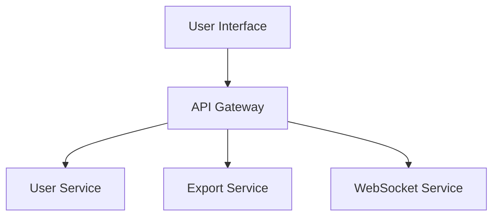

# Page Template and Markers

This document defines the page structure, writing principles, and marker
conventions for wiki pages.

## Writing Principles

These govern *what goes inside* a section. The markers below govern *how a
section is delimited* — both apply to every page.

### 1. TL;DR First

**Every section opens with a TL;DR** — a 1–2 sentence summary of what the
section establishes, before any detail. A reader who stops after the TL;DR
should still have learned the main point.

```markdown
## Request Authentication

**TL;DR**: Every request passes through a middleware chain that validates a JWT,
loads the user, and attaches it to the request context. Unauthenticated requests
are rejected before they reach any handler.

{details follow}
```

### 2. Progressive Disclosure

**Big picture first, then drill down.** Do not front-load implementation
details. Order every page and every section so a reader can stop at any depth
and still have a coherent (if less complete) understanding.

- Start with the at-a-glance summary table — the reader should grasp the system
  in 30 seconds.
- Then the architecture and the WHY.
- Then components, then methods, then edge cases.

### 3. Table-Driven Presentation

**Prefer tables over prose for any structured information** — APIs, parameters,
configuration keys, components, comparisons, data models.

- Start each major section with an at-a-glance **summary table** before details.
- **Every table listing code artifacts MUST carry a "Source" column** with
  citations. See `evidence_citation_policy.md` for the citation forms.
- If a paragraph is really just a list of things, convert it to a table.

```markdown
| Component | Responsibility | Key File | Source |
|-----------|----------------|----------|--------|
| Router | Maps URLs to handlers | `src/router.ts` | [router.ts:12-48](url) |
| AuthMiddleware | Validates JWTs | `src/auth.ts` | [auth.ts:20-75](url) |
```

### 4. Depth Before Breadth

**Trace real code paths. Never guess from file names.**

- If function A calls B calls C, follow it all the way and say so.
- Explain WHY something exists before explaining WHAT it does.
- No hand-waving. Never write "this likely handles..." — read the code and state
  what it actually does.
- Distinguish fact from inference, and mark inferences explicitly.

A shallow page that covers ten subsystems is worth less than a deep page that
covers three.

### 5. Systems Thinking

Organize from the whole down to the parts, at every scale:

```
Architecture → Subsystems → Components → Methods
```

Each level should make the next level's existence feel inevitable. A reader who
knows the architecture should be able to predict roughly what subsystems exist.

### 6. Visual Rhythm

Alternate prose, tables, diagrams, and code blocks. Avoid long walls of text.
See `mermaid_policy.md` for the per-page diagram minimums (3–5 diagrams, at
least 2 different types) — those minimums are a requirement of this template,
not a suggestion.

## Page Structure

Every wiki page MUST follow this structure:

```markdown
<!-- PAGE_ID: {page_id} -->
<details>
<summary>📚 Relevant source files</summary>

The following files were used as context for generating this wiki page:

- [file1.ext:1-100](url)
- [file2.ext:50-200](url)

</details>

# {Page Title}

> **Related Pages**: [[Page 2 Title|02_page-2.md]], [[Page 3 Title|03_page-3.md]]

---

<!-- BEGIN:AUTOGEN {section_id} -->
## {Section Title}

**TL;DR**: {1-2 sentence summary of what this section establishes}

{Summary table, then detail, with source citations throughout}

Sources: [file.ext:10-20](url)
<!-- END:AUTOGEN {section_id} -->

---

<!-- BEGIN:AUTOGEN {next_section_id} -->
## {Next Section Title}

**TL;DR**: {1-2 sentence summary}

{More content}

Sources: [file.ext:30-40](url)
<!-- END:AUTOGEN {next_section_id} -->

---
```

## Markers

### PAGE_ID Marker

**Purpose**: Uniquely identify the page for incremental updates.

**Format**:
```html
<!-- PAGE_ID: {page_id} -->
```

**Rules**:
- Must be at the very beginning of the file
- page_id must match the ID in toc.json
- One PAGE_ID per file

**Example**:
```html
<!-- PAGE_ID: myproject_01_overview -->
```

### AUTOGEN Markers

**Purpose**: Mark auto-generated content boundaries for safe updates.

**Format**:
```html
<!-- BEGIN:AUTOGEN {section_id} -->
{generated content}
<!-- END:AUTOGEN {section_id} -->
```

**Rules**:
- Every autogen section must have both BEGIN and END markers
- section_id must match the ID in toc.json
- Content outside markers is preserved during updates
- Include a `---` separator after each section

**Example**:
```html
<!-- BEGIN:AUTOGEN myproject_01_overview_introduction -->
## Introduction

This project provides...

Sources: [README.md:1-10](https://github.com/...)
<!-- END:AUTOGEN myproject_01_overview_introduction -->

---
```

### Nested Sections

For nested sections, use appropriate heading levels:

```markdown
<!-- BEGIN:AUTOGEN myproject_02_arch_frontend -->
## Frontend Architecture

Overview of frontend...

### Component Structure

<!-- BEGIN:AUTOGEN myproject_02_arch_frontend_components -->
Details about components...

Sources: [Component.tsx:15-30](url)
<!-- END:AUTOGEN myproject_02_arch_frontend_components -->

### State Management

<!-- BEGIN:AUTOGEN myproject_02_arch_frontend_state -->
State management details...

Sources: [store.ts:1-50](url)
<!-- END:AUTOGEN myproject_02_arch_frontend_state -->

<!-- END:AUTOGEN myproject_02_arch_frontend -->

---
```

## Heading Levels

| Section Depth | Heading | Markdown |
|---------------|---------|----------|
| Page title | H1 | `#` |
| Top-level section | H2 | `##` |
| Nested level 1 | H3 | `###` |
| Nested level 2 | H4 | `####` |
| Nested level 3 | H5 | `#####` |

## Source Files List

At the top of each page, include a collapsible list of source files:

```markdown
<details>
<summary>📚 Relevant source files</summary>

The following files were used as context for generating this wiki page:

- [Button.tsx:1-120](https://github.com/company/myapp/blob/abc123/README.md#L1-L200)
- [styles.css:1-200](https://github.com/company/myapp/blob/abc123/styles.css#L1-L200)
- [api.ts:1-160](https://github.com/company/myapp/blob/abc123/api.ts#L1-L160)

</details>
```

## Related Pages

Link to related pages using wiki-style links:

```markdown
> **Related Pages**: [[02_architecture.md]], [[03_api.md]]
```

## Section Content Guidelines

### Section Header

Each section MUST start with:
1. The heading (H2 or appropriate level)
2. A **TL;DR** — 1–2 sentences stating what the section establishes

```markdown
## Component Architecture

**TL;DR**: The frontend is a tree of presentational components fed by a single
store; only route-level containers talk to the API, which is what keeps the leaf
components trivially testable.
```

Do not open a section with a content-free restatement of its own title ("This
section describes the component structure"). Say something.

### Section Body

Ordered by progressive disclosure — summary before detail:
1. An at-a-glance **summary table** (with a Source column) where the section
   introduces multiple artifacts
2. Explanatory text with source citations, WHY before WHAT
3. Diagrams (if `diagrams_needed: true`), each followed by its
   `<!-- Sources: ... -->` comment block
4. Tables for any remaining structured data
5. Code examples from real source files (if relevant)

### Section Footer

End each section with:
1. Source citations summary (if not inline)
2. The END:AUTOGEN marker
3. A horizontal rule `---`

```markdown
Sources: [Component.tsx:15-30](url), [types.ts:1-20](url)
<!-- END:AUTOGEN section_id -->

---
```

## Manual Sections

For sections where `autogen: false`, leave a placeholder:

```markdown
## Manual Section Title

<!-- This section is manually maintained -->

{Manual content goes here}

---
```

Do NOT add AUTOGEN markers to manual sections.

## Complete Example

```markdown
<!-- PAGE_ID: myapp_01_overview -->
<details>
<summary>📚 Relevant source files</summary>

The following files were used as context for generating this wiki page:

- [README.md:1-200](README.md)
- [package.json:1-200](package.json)
- [src/index.ts:1-200](src/index.ts)

</details>

# Project Overview

> **Related Pages**: [[Architecture|02_architecture.md]], [[Getting Started|03_getting-started.md]]

---

<!-- BEGIN:AUTOGEN myapp_01_overview_introduction -->
## Introduction

**TL;DR**: MyApp is a React/TypeScript workflow tool. Its one structural
commitment is that the UI layer never talks to the database — every read and
write goes through the API service boundary, which is what makes the frontend
independently deployable.

MyApp exists to give operations teams a single place to manage user data and
workflows that previously lived in three separate spreadsheets ([README.md:1-15](https://github.com/company/myapp/blob/abc123/README.md#L1-L15)).

The application follows a modular architecture with clear separation of concerns between the frontend UI layer and the backend API services ([README.md:1-15](https://github.com/company/myapp/blob/abc123/README.md#L1-L15)).

Sources: [README.md:1-15](https://github.com/company/myapp/blob/abc123/README.md#L1-L15)
<!-- END:AUTOGEN myapp_01_overview_introduction -->

---

<!-- BEGIN:AUTOGEN myapp_01_overview_features -->
## Key Features

**TL;DR**: Three capabilities — user management, data export, and real-time
updates — all fronted by a single API gateway that owns authentication.

| Feature | Description | Source |
|---------|-------------|--------|
| User Management | Create, update, and delete user accounts | [users/index.ts:10-25](url) |
| Data Export | Export data in CSV and JSON formats | [export/index.ts:5-20](url) |
| Real-time Updates | WebSocket-based live updates | [websocket/index.ts:1-30](url) |


<!-- Sources: src/index.ts:1-50, src/gateway/routes.ts:12-64 -->

Sources: [src/index.ts:1-50](url), [package.json:1-30](url)
<!-- END:AUTOGEN myapp_01_overview_features -->

---

## Notes

<!-- This section is manually maintained -->

Additional notes and updates will be added here as the project evolves.

---
```
