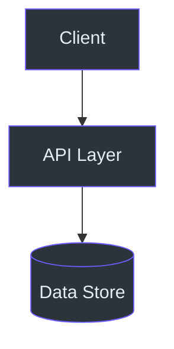

# Phase: onboarding (Phase 7)

## Goal

Generate four audience-tailored onboarding guides plus a hub page in `{output_dir}/onboarding/`. Each guide gives exactly one stakeholder the understanding they need — and nothing they don't:

- **Contributor** — how to set up, ship a first change, and follow the codebase's patterns
- **Staff Engineer** — the *why* behind every architectural decision
- **Executive** — capabilities, risks, ownership, and investment context (no code)
- **Product Manager** — features, user journeys, limits, and constraints (no jargon)

The guides are standalone deliverables. They are not TOC pages: they carry no `PAGE_ID` or `AUTOGEN` markers and are not listed in `{output_dir}/toc.json`.

## Inputs

| Name | Required | Default | Description |
|------|----------|---------|-------------|
| `repo_path` | Yes | - | Absolute repository path |
| `output_dir` | No | `docs/wiki` | Documentation output directory |
| `toc_file` | No | `{output_dir}/toc.json` | Supplies `project.name`, `repo_base_url`, `ref_commit_hash`, language |
| `doc_dir` | No | `{output_dir}` | Existing wiki pages, for cross-links from the guides |
| `language` | No | `en-US` | Output language/locale |

## Outputs

| Path | Description |
|------|-------------|
| `{output_dir}/onboarding/index.md` | Onboarding hub — project summary and guide selector table |
| `{output_dir}/onboarding/contributor-guide.md` | New contributors (assumes Python or JS background) |
| `{output_dir}/onboarding/staff-engineer-guide.md` | Staff/principal engineers |
| `{output_dir}/onboarding/executive-guide.md` | VP/director-level engineering leaders |
| `{output_dir}/onboarding/product-manager-guide.md` | Product managers and non-engineering stakeholders |

## References

- `../evidence_citation_policy.md`: citation format and placement rules — every non-trivial claim needs one
- `../mermaid_policy.md`: diagram syntax rules the linter enforces

## Scripts

### `read_files.py`

Read source files with line numbers so citations are real. Never use ad-hoc file reads when a citation will be drawn from the content.

```bash
python3 ${CLAUDE_PLUGIN_ROOT}/skills/deepwiki/scripts/read_files.py \
  --repo-path "{repo_path}" \
  --files '["src/**/*.ts", "README.md"]' \
  --line-numbers
```

### `validate_mermaid.py`

Pure-stdlib Mermaid linter. Zero external dependencies — nothing to install.

```bash
python3 ${CLAUDE_PLUGIN_ROOT}/skills/deepwiki/scripts/validate_mermaid.py \
  --input "{output_dir}/onboarding" \
  --invalid-only
```

## Citation Mode

Resolve once, before writing anything, from `{toc_file}`:

| Condition | Mode | Format |
|-----------|------|--------|
| `project.repo_base_url` present | Remote | `[file.ts:42](REPO_URL/blob/COMMIT/file.ts#L42)` |
| `project.repo_base_url` absent | Local | `(file.ts:42)` |

`COMMIT` is `project.ref_commit_hash`. If `{toc_file}` does not exist, derive the same values directly:

```bash
git remote get-url origin   # → REPO_URL (absent = local-only repo)
git rev-parse HEAD          # → COMMIT
```

**Never invent line numbers.** Take them from `read_files.py` output, where each line is prefixed `{line_num}→`.

## Workflow

### 1. Detect Language and Technologies

Scan build manifests to pick the primary language for all code examples:

| Manifest | Language |
|----------|----------|
| `package.json` / `tsconfig.json` | TypeScript / JavaScript |
| `pyproject.toml` / `setup.py` / `requirements.txt` | Python |
| `*.csproj` / `*.sln` | C# / .NET |
| `Cargo.toml` | Rust |
| `go.mod` | Go |
| `pom.xml` / `build.gradle` | Java |

Then pick a **comparison language** for cross-language explanations — the one the reader already knows:

| Primary | Compare against |
|---------|-----------------|
| C#, Java, Go, TypeScript | Python |
| Python | JavaScript |
| Rust | C++ or Go |
| Swift | TypeScript |

Finally, note the **key technologies** worth explaining from first principles: actor frameworks (Orleans, Akka), document stores (Cosmos, Mongo), RDBMS (PostgreSQL, MySQL), caches (Redis), message buses (Kafka, RabbitMQ, Service Bus), API protocols (gRPC, GraphQL), container platforms.

### 2. Write `onboarding/index.md`

A landing page with a one-paragraph project summary and a guide selector table:

```markdown
| Guide | Audience | What You'll Learn | Time |
|-------|----------|-------------------|------|
| [Contributor Guide](./contributor-guide.md) | New contributors with Python/JS experience | Setup, first PR, codebase patterns | ~30 min |
| [Staff Engineer Guide](./staff-engineer-guide.md) | Staff/principal engineers | Architecture, design decisions, system boundaries | ~45 min |
| [Executive Guide](./executive-guide.md) | VP/directors of engineering | Capabilities, risks, team topology, investment thesis | ~20 min |
| [Product Manager Guide](./product-manager-guide.md) | Product managers | Features, user journeys, constraints, data model | ~20 min |
```

### 3. Write `onboarding/contributor-guide.md`

**Audience**: Engineers joining the project. Assumes proficiency in Python or JavaScript and general software engineering experience — nothing about *this* language or *this* codebase.
**Length**: 1000–2500 lines. Progressive: never reference a concept before explaining it.

**Part I: Foundations** — skip entirely if the repo is already Python or JS.

1. **{Primary Language} for Python/JS Engineers** — Side-by-side syntax tables, async model, collections, type system, package management. Concrete code comparisons, NOT abstract descriptions.
2. **{Primary Framework} Essentials** — Compare to the equivalent framework the reader knows (FastAPI, Express). Request pipeline, routing, dependency injection, configuration.
3. **{Key Technology 1} from First Principles** — The problem it solves, core concepts by comparison, how THIS system uses it.
4. **{Key Technology 2} from First Principles** — Same treatment for the second key technology.

**Part II: This Codebase**

5. **The Big Picture** — One-sentence summary, core entities table, architecture `graph TD` diagram.
6. **Project Structure** — Annotated directory tree: what lives where, and why.
7. **Core Concepts** — Domain terminology explained with real code from the repo.
8. **Domain Model & Data Flow** — `erDiagram` of core entities, data invariants, and a `sequenceDiagram` (with `autonumber`) tracing a typical request end to end.
9. **Key Patterns** — "If you want to add X, follow this pattern" templates, built from real code.

**Part III: Getting Productive**

10. **Prerequisites & Setup** — Table: Tool, Version, Install Command. Step-by-step, with the expected output at each step.
11. **Your First Task** — End-to-end walkthrough of adding one simple feature.
12. **Development Workflow** — Branch strategy, commit conventions, PR process. Use a `flowchart`.
13. **Running Tests** — All tests, one file, one test, coverage.
14. **Debugging Guide** — Table: Symptom, Cause, Fix.
15. **Common Pitfalls** — The mistakes every new contributor makes, and how to dodge them.

**Appendices**

- **Glossary** — 40+ terms.
- **Key File Reference** — Table: Path, Purpose, Why It Matters, Source.
- **Quick Reference Card** — Cheat sheet of the most-used commands and patterns.

**Rules**

- All code examples in the detected primary language, drawn from the actual repo.
- Every command copy-pasteable, with its expected output.
- **Minimum 5 Mermaid diagrams** (architecture, ER, sequence, flowchart, state).
- Every diagram followed by a `<!-- Sources: ... -->` comment block.
- Every claim carries a citation.

### 4. Write `onboarding/staff-engineer-guide.md`

**Audience**: Staff/principal engineers who need the *why* behind every decision. Deep systems experience; may not know this repo's language.
**Length**: 800–1200 lines. Dense, opinionated, architectural.

**Required sections**

1. **Executive Summary** — What the system is, in one dense paragraph. What it owns vs. what it delegates.
2. **The Core Architectural Insight** — The SINGLE most important concept. Include pseudocode in a language *different* from the repo's.
3. **System Architecture** — Full `graph TD` (entry → middleware → controllers → services → storage → external). Call out the "heart" of the system.
4. **Domain Model** — `erDiagram` of core entities. Data invariants table: Entity, Invariant, Enforced By, Source.
5. **Key Abstractions & Interfaces** — `classDiagram` of the load-bearing abstractions.
6. **Component Types & Execution Paths** — Table: Component, Type, Execution Path, Key File, Source.
7. **Request Lifecycle** — `sequenceDiagram` (with `autonumber`), entry to response.
8. **State Transitions** — `stateDiagram-v2` for entities with a meaningful lifecycle.
9. **Decision Log** — Table: Decision, Alternatives Considered, Rationale, Source.
10. **Dependency Rationale** — Table: Dependency, Purpose, What It Replaced, Source.
11. **Storage & Data Architecture** — Stores used, data access layer, consistency model. Comparison table.
12. **Failure Modes & Error Handling** — `flowchart` of error propagation paths.
13. **API Surface & Protocols** — Table: Method, Path, Handler, Auth, Source.
14. **Configuration & Feature Flags** — Table: Key, Default, Description, Source.
15. **Performance Characteristics** — Bottlenecks, scaling limits, hot paths.
16. **Security Model** — Auth, authorization, trust boundaries, data sensitivity.
17. **Testing Strategy** — What's tested, what isn't, and the philosophy behind that split.
18. **Known Technical Debt** — Table: Issue, Risk Level, Affected Files, Source.
19. **Where to Go Deep** — Recommended reading order of source files; links into `{doc_dir}` wiki pages.

**Rules**

- Explain concepts with **pseudocode in a different language** than the repo's.
- Use **comparison tables** to map unfamiliar constructs (e.g. `Task<T>` ≈ `Awaitable[T]`).
- Dense prose plus tables — NOT shallow bullet lists.
- **Use tables aggressively**: decisions, dependencies, and debt should ALL be tables with a Source column.
- **Minimum 5 Mermaid diagrams** (architecture, ER, class, sequence, state, flowchart), each followed by `<!-- Sources: ... -->`.
- Focus on WHY decisions were made, not just WHAT exists.

### 5. Write `onboarding/executive-guide.md`

**Audience**: VP/director of engineering. Needs capability overview, risk assessment, and investment context — NOT code-level detail.
**Length**: 400–800 lines. Strategic, concise, decision-oriented.

**Required sections**

1. **System Overview** — What it does, who uses it, business value. 2–3 sentences.
2. **Capability Map** — Table: Capability, Status (Built/Partial/Planned), Maturity, Dependencies. What the system can and cannot do today.
3. **Architecture at a Glance** — High-level `graph TD` of services, data stores, and external integrations. Deployment units and team boundaries only — NO internal code detail.
4. **Team Topology** — Table: Component, Owner, Criticality, Bus Factor.
5. **Technology Investment Thesis** — Table: Technology, Purpose, Alternatives Considered, Risk Level.
6. **Risk Assessment** — Table: Risk, Likelihood, Impact, Mitigation, Owner. Cover reliability, security, scalability, compliance.
7. **Cost & Scaling Model** — How cost scales with usage, where the bottlenecks are, when the next scaling investment lands.
8. **Dependency Map** — `graph TD` of critical external dependencies. Table: Dependency, Type (Service/Library/Platform), Risk if Unavailable.
9. **Key Metrics & Observability** — What's measured, which dashboards exist, alerting coverage. Table: Metric, Current Value, Target, Source.
10. **Roadmap Alignment** — Engineering workstreams mapped to business priorities: in progress, planned, blocked.
11. **Technical Debt Summary** — Top 5 items. Table: Issue, Business Impact, Effort to Fix, Priority.
12. **Recommendations** — 3–5 actionable recommendations for next quarter, ordered by impact.

**Rules**

- **NO code snippets.** This guide is for engineering leaders, not coders.
- **Diagrams at the service/team level**, never class or function level.
- **Business language** — translate every technical fact into impact: reliability, velocity, cost, risk.
- Tables for every structured finding. This audience reads tables, not prose.
- **Minimum 3 Mermaid diagrams** (architecture overview, dependency map, capability/roadmap).
- Every claim backed by evidence — cite wiki sections or source files so a skeptic can verify.

### 6. Write `onboarding/product-manager-guide.md`

**Audience**: Product managers and non-engineering stakeholders. Needs to know what the system does, what's possible, and where the boundaries are — NOT how it's built.
**Length**: 400–800 lines. User-centric, feature-focused, constraint-aware.

**Required sections**

1. **What This System Does** — 2–3 sentence elevator pitch in user-facing language. Zero jargon.
2. **User Journey Map** — `journey` or `graph TD` diagram of the primary user flows.
3. **Feature Capability Map** — Table: Feature, Status (Live/Beta/Planned/Not Possible), User-Facing Behavior, Limitations. Comprehensive: what's built and what isn't.
4. **Data Model (Product View)** — Simplified `erDiagram` of the entities users actually touch. Explain in business terms ("A Project has many Documents"), never in schema terms ("FK relationship").
5. **Configuration & Feature Flags** — Table: Flag/Config, What It Controls, Default, Who Can Change It. What can be toggled without engineering work.
6. **API Capabilities** — Table: Capability, Endpoint/Method, Authentication, Rate Limits. Written for integration partners, not developers.
7. **Performance & SLAs** — Table: Operation, Expected Latency, Throughput Limit, Current SLA.
8. **Known Limitations & Constraints** — An honest list of what the system can't do, or does poorly. Table: Limitation, User Impact, Workaround, Planned Fix.
9. **Data & Privacy** — Table: Data Type, Storage Location, Retention, Compliance.
10. **Glossary** — Domain terms in plain language, not engineering jargon.
11. **FAQ** — 10+ questions a PM would actually ask, answered concisely.

**Rules**

- **ZERO engineering jargon.** No "middleware", "dependency injection", "ORM".
- **User-centric framing** — describe what users experience, not what the code does.
- If a technical concept is unavoidable, define it in one plain sentence ("Feature flags — switches that turn features on or off without shipping new code").
- Tables for every structured finding. PMs scan tables, not prose.
- **Minimum 3 Mermaid diagrams** (user journey, data model, feature/capability map).
- Every claim grounded in evidence — cite the wiki section or source file so it can be checked.

### 7. Mermaid Rules (ALL guides)

Follow `../mermaid_policy.md`. Every diagram must use dark-mode colors:

| Element | Value |
|---------|-------|
| Node fill | `#2d333b` |
| Node border | `#6d5dfc` |
| Node text | `#e6edf3` |
| Subgraph background | `#161b22` |
| Subgraph border | `#30363d` |
| Lines | `#8b949e` |



Also:
- Prefer `graph TD` (top-down). Horizontal graphs scroll badly on narrow pages.
- Quote every node label: `A["User Input"]`, never `A[User Input]`.
- No parentheses or special characters in subgraph names.
- Never use `<br/>` inside a Mermaid label — use `<br>` or a line break.
- Never put source citations inside a diagram. They go in the `<!-- Sources: ... -->` block after it.

### 8. Validate

1. Lint every diagram — zero external dependencies, nothing to install:

```bash
python3 ${CLAUDE_PLUGIN_ROOT}/skills/deepwiki/scripts/validate_mermaid.py \
    --input "{output_dir}/onboarding" \
    --invalid-only \
    --output "{output_dir}/_reports/mermaid_invalid.json"
```

Fix each invalid block using its `fix_hint` and `../mermaid_policy.md` (max 3 attempts per diagram). Re-run until `total_invalid == 0`. If a diagram still fails after 3 attempts, comment it out and leave a TODO naming the error.

2. Then confirm by inspection:

- [ ] Every file path named in a guide exists in the repo
- [ ] Every class/method name is real, not hallucinated — no invented line numbers
- [ ] No bare angle-bracket generics (`List<T>`) outside code fences — wrap them in backticks
- [ ] Contributor and Staff guides each have ≥ 5 diagrams; Executive and PM guides ≥ 3
- [ ] Executive guide contains no code snippets
- [ ] PM guide contains no engineering jargon
- [ ] All five files exist under `{output_dir}/onboarding/`

Do NOT run `validate_docs_structure.py` against `{output_dir}/onboarding/`. Those guides are not TOC pages; structure validation is scoped to `{toc_file}` and would report them as unexpected files.
