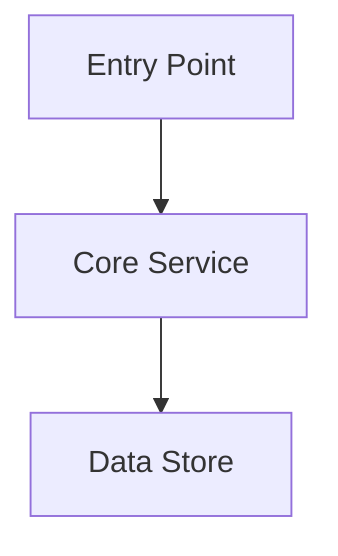

# Phase: vitepress-build (Optional)

## Goal

Package the generated wiki Markdown into a browsable VitePress static site with:
- a dark-only theme matching the wiki's Mermaid palette
- dark-mode Mermaid diagrams with click-to-zoom (pan, wheel-zoom, keyboard)
- a sidebar generated from `{output_dir}/toc.json`
- optional GitHub Pages deployment via GitHub Actions

## This Phase Is Optional

**The core wiki has zero dependencies.** `repo-scan`, `toc-design`, `doc-write`, `validate-docs`, and `doc-summary` run on Python 3 stdlib alone — no Node, no npm, no third-party Python packages, no external binaries. The Markdown in `{output_dir}` renders as-is on GitHub, GitLab, and any Markdown viewer, Mermaid diagrams included. Nothing needs to be built for the wiki to be usable.

Run this phase **only when the user explicitly asks** for a website, a static site, a VitePress build, or a GitHub Pages deployment. VitePress is an npm tool, so this phase — and only this phase — introduces Node.js and npm packages. Never install anything for the core pipeline.

Before starting:
1. Confirm the user wants a site (do not infer it from "generate the wiki").
2. Confirm `node` and `npm` are available (`node --version`). If not, stop and report — the wiki Markdown is still complete and usable.
3. Never modify `{output_dir}/*.md`. This phase **copies** the Markdown into `{site_dir}` and post-processes the copy, so the pristine GitHub-renderable wiki stays untouched.

## Inputs

| Name | Required | Default | Description |
|------|----------|---------|-------------|
| `doc_dir` | No | `{output_dir}` | Directory containing generated `.md` docs |
| `output_dir` | No | `docs/wiki` | Base output dir of the generated wiki |
| `toc_file` | No | `{output_dir}/toc.json` | TOC used to build nav and sidebar |
| `site_dir` | No | `wiki-site` | Directory to scaffold the VitePress project in |
| `repo_path` | No | `.` | Repository root path |
| `deploy` | No | `false` | Also generate the GitHub Pages workflow (Step 7) |

## Outputs

| Path | Description |
|------|-------------|
| `{site_dir}/package.json` | npm manifest (VitePress + Mermaid + medium-zoom) |
| `{site_dir}/.gitignore` | Ignores `node_modules/`, `.vitepress/cache/`, `.vitepress/dist/` |
| `{site_dir}/index.md` | Wiki landing page (technical, not marketing) |
| `{site_dir}/*.md` | Post-processed copies of the wiki pages |
| `{site_dir}/.vitepress/config.mts` | VitePress config: dark theme, Mermaid vars, sidebar from `toc.json` |
| `{site_dir}/.vitepress/theme/index.ts` | Theme setup: image zoom + Mermaid SVG zoom overlay |
| `{site_dir}/.vitepress/theme/custom.css` | Dark theme + Mermaid overrides + zoom CSS |
| `{site_dir}/.vitepress/dist/` | Built static site (after Step 6) |
| `.github/workflows/deploy-wiki.yml` | GitHub Pages workflow (only if `deploy=true`) |

## Steps

### 1. Scaffold the site directory

Create `{site_dir}` and copy the generated Markdown into it. Do not move — copy.

```
{site_dir}/
├── package.json
├── .gitignore
├── index.md                    # Landing page (generated in Step 2)
├── 01_overview.md              # Copies of {doc_dir}/*.md
├── 02_architecture.md
├── ...
└── .vitepress/
    ├── config.mts
    ├── public/
    │   └── logo.svg
    └── theme/
        ├── index.ts
        └── custom.css
```

Skip `{doc_dir}/_reports/` and `{doc_dir}/_context/` — those are pipeline artifacts, not wiki pages.

**`package.json`**:
```json
{
  "name": "wiki-site",
  "version": "1.0.0",
  "private": true,
  "type": "module",
  "scripts": {
    "dev": "vitepress dev",
    "build": "vitepress build",
    "preview": "vitepress preview"
  },
  "devDependencies": {
    "medium-zoom": "^1.1.0",
    "mermaid": "^11.12.2",
    "vitepress": "^1.6.4",
    "vitepress-plugin-mermaid": "^2.0.17"
  }
}
```

**`.gitignore`**:
```
node_modules/
.vitepress/cache/
.vitepress/dist/
```

### 2. Generate `index.md` — a wiki landing page, not a product page

Build the landing page from `toc.json` (`project.name`, `project.description`, `pages[]`) and the repo README.

**DO include**:
- 1–2 sentence technical description of what the project does
- Quick Start with commands actually found in the repo (README, `package.json` scripts, `Makefile`)
- One architecture Mermaid diagram, followed by a `<!-- Sources: ... -->` comment
- A Documentation Map table linking every page in `toc.json`
- A Key Files table with citations
- A Tech Stack table

**DO NOT include**:
- VitePress `hero:` frontmatter, action buttons, or feature cards
- Marketing copy ("powerful", "blazing fast", "enterprise-grade")
- Any claim not backed by a citation

Citations follow the same rules as every other wiki page: remote repo `[file.ts:42](REPO_URL/blob/COMMIT/file.ts#L42)`, local repo `(file.ts:42)`. Never invent line numbers.

````markdown
---
title: {project.name} — Documentation
description: {project.description}
---

# {project.name}

{One or two technical sentences.}

## Quick Start

```bash
git clone {repo_url}
cd {repo_name}
{actual install + run commands from the repo}
```

## Architecture Overview


<!-- Sources: src/main.ts:1, src/server.ts:1 -->

## Documentation Map

| Section | Description |
|---------|-------------|
| [Overview](./01_overview.md) | {page.description from toc.json} |
| [Architecture](./02_architecture.md) | {page.description from toc.json} |

## Key Files

| File | Purpose | Source |
|------|---------|--------|
| `src/main.ts` | Application entry point | ([main.ts:1](REPO_URL/blob/COMMIT/src/main.ts#L1)) |

## Tech Stack

| Technology | Purpose |
|-----------|---------|
| TypeScript | Primary language |
````

### 3. Write `.vitepress/config.mts`

The config MUST:
- wrap the export in `withMermaid()` from `vitepress-plugin-mermaid`
- set `appearance: 'dark'` (dark-only — the Mermaid palette assumes a dark canvas)
- set `ignoreDeadLinks: true` (wiki pages link to repo source paths that don't exist as site routes)
- set `outline: { level: [2, 3] }` and `markdown: { lineNumbers: true }`
- include `vite: { optimizeDeps: { include: ['mermaid'] } }`
- generate the sidebar from `{output_dir}/toc.json`, not from a directory scan

The Mermaid `themeVariables` below encode the wiki's diagram palette — node fills `#2d333b`, borders `#6d5dfc`, text `#e6edf3`, subgraph backgrounds `#161b22` with `#30363d` borders, lines `#8b949e`. Do not change these values; diagrams authored in `doc-write` are designed against them.

```typescript
import { defineConfig } from 'vitepress'
import { withMermaid } from 'vitepress-plugin-mermaid'
import { readFileSync } from 'node:fs'

// Sidebar is generated from toc.json — the single source of truth for structure.
const toc = JSON.parse(readFileSync('../docs/wiki/toc.json', 'utf-8'))

const sidebar = toc.pages.map((page: any, i: number) => ({
  text: page.title,
  collapsed: i >= 3,                       // first 3 groups open, rest collapsed
  items: [
    { text: 'Top', link: `/${page.filename.replace(/\.md$/, '')}` },
    ...(page.sections ?? []).map((s: any) => ({
      text: s.title,
      link: `/${page.filename.replace(/\.md$/, '')}#${slug(s.title)}`,
    })),
  ],
}))

function slug(title: string): string {
  return title.toLowerCase().replace(/[^\w\s-]/g, '').trim().replace(/\s+/g, '-')
}

export default withMermaid(
  defineConfig({
    title: toc.project.name,
    description: toc.project.description,
    appearance: 'dark',
    ignoreDeadLinks: true,
    head: [
      ['link', { rel: 'preconnect', href: 'https://fonts.googleapis.com' }],
      ['link', {
        rel: 'stylesheet',
        href: 'https://fonts.googleapis.com/css2?family=Inter:wght@400;500;600;700&family=JetBrains+Mono:wght@400;500&display=swap',
      }],
    ],
    markdown: { lineNumbers: true },
    themeConfig: {
      logo: '/logo.svg',
      outline: { level: [2, 3] },
      nav: [{ text: 'Home', link: '/' }],
      sidebar,
      search: { provider: 'local' },
    },
    vite: { optimizeDeps: { include: ['mermaid'] } },
    mermaid: {
      theme: 'dark',
      themeVariables: {
        darkMode: true,
        background: '#0d1117',
        primaryColor: '#2d333b',
        primaryTextColor: '#e6edf3',
        primaryBorderColor: '#6d5dfc',
        secondaryColor: '#1c2333',
        secondaryTextColor: '#e6edf3',
        secondaryBorderColor: '#6d5dfc',
        tertiaryColor: '#161b22',
        tertiaryTextColor: '#e6edf3',
        tertiaryBorderColor: '#30363d',
        lineColor: '#8b949e',
        textColor: '#e6edf3',
        mainBkg: '#2d333b',
        nodeBkg: '#2d333b',
        nodeBorder: '#6d5dfc',
        nodeTextColor: '#e6edf3',
        clusterBkg: '#161b22',
        clusterBorder: '#30363d',
        titleColor: '#e6edf3',
        edgeLabelBackground: '#1c2333',
        actorBkg: '#2d333b',
        actorTextColor: '#e6edf3',
        actorBorder: '#6d5dfc',
        actorLineColor: '#8b949e',
        signalColor: '#e6edf3',
        signalTextColor: '#e6edf3',
        labelBoxBkgColor: '#2d333b',
        labelBoxBorderColor: '#6d5dfc',
        labelTextColor: '#e6edf3',
        loopTextColor: '#e6edf3',
        activationBorderColor: '#6d5dfc',
        activationBkgColor: '#1c2333',
        sequenceNumberColor: '#e6edf3',
        noteBkgColor: '#2d333b',
        noteTextColor: '#e6edf3',
        noteBorderColor: '#6d5dfc',
        classText: '#e6edf3',
        labelColor: '#e6edf3',
        altBackground: '#161b22',
      },
    },
  })
)
```

Adjust the `readFileSync` path to the actual relative path from `{site_dir}/.vitepress/` to `{output_dir}/toc.json`.

### 4. Write `.vitepress/theme/index.ts`

Two zoom systems are needed. Images are `` and work with `medium-zoom`; Mermaid renders `<svg>`, which `medium-zoom` cannot handle — that needs a custom fullscreen overlay.

**Non-negotiable implementation notes** (each one is a real bug that will otherwise bite):
- Use `setup()` with `onMounted` + a route watcher. **Not** `enhanceApp()` — `document` does not exist during SSR.
- **Poll for the Mermaid SVGs.** `vitepress-plugin-mermaid` renders asynchronously; the SVGs do not exist when `onMounted` fires. Retry up to 20 times at 500 ms.
- **Clone the SVG** into the overlay. Moving it destroys the page layout.
- **Backfill a missing `viewBox`** from `getBBox()`, or scaling silently does nothing.
- **Mark handled containers** with `data-zoom-attached` so route changes don't stack duplicate listeners.

```typescript
import { onMounted, watch, nextTick } from 'vue'
import { useRoute } from 'vitepress'
import DefaultTheme from 'vitepress/theme'
import mediumZoom from 'medium-zoom'
import './custom.css'

export default {
  extends: DefaultTheme,
  setup() {
    const route = useRoute()

    const openDiagramModal = (svg: SVGSVGElement) => {
      const overlay = document.createElement('div')
      overlay.className = 'diagram-zoom-overlay'

      const wrapper = document.createElement('div')
      wrapper.className = 'diagram-zoom-wrapper'

      const controls = document.createElement('div')
      controls.className = 'diagram-zoom-controls'
      controls.innerHTML = `
        <button class="zoom-btn" data-action="zoom-in" title="Zoom in (+)">+</button>
        <button class="zoom-btn" data-action="zoom-out" title="Zoom out (-)">−</button>
        <button class="zoom-btn" data-action="zoom-reset" title="Reset (0)">Reset</button>
        <button class="zoom-btn zoom-close" data-action="close" title="Close (Esc)">✕</button>
      `

      const content = document.createElement('div')
      content.className = 'diagram-zoom-content'

      const cloned = svg.cloneNode(true) as SVGSVGElement
      if (!cloned.getAttribute('viewBox')) {
        const bbox = svg.getBBox()
        cloned.setAttribute('viewBox', `${bbox.x} ${bbox.y} ${bbox.width} ${bbox.height}`)
      }
      cloned.style.width = '100%'
      cloned.style.height = 'auto'
      cloned.style.maxHeight = 'none'

      content.appendChild(cloned)
      wrapper.appendChild(controls)
      wrapper.appendChild(content)
      overlay.appendChild(wrapper)
      document.body.appendChild(overlay)
      document.body.style.overflow = 'hidden'

      let scale = 1
      let translateX = 0
      let translateY = 0
      const applyTransform = () => {
        content.style.transform = `translate(${translateX}px, ${translateY}px) scale(${scale})`
      }

      const closeOverlay = () => {
        document.removeEventListener('keydown', keyHandler)
        document.body.style.overflow = ''
        overlay.remove()
      }

      controls.addEventListener('click', (e) => {
        const action = (e.target as HTMLElement)
          .closest('[data-action]')?.getAttribute('data-action')
        if (action === 'zoom-in') { scale = Math.min(scale * 1.3, 5); applyTransform() }
        if (action === 'zoom-out') { scale = Math.max(scale / 1.3, 0.2); applyTransform() }
        if (action === 'zoom-reset') { scale = 1; translateX = 0; translateY = 0; applyTransform() }
        if (action === 'close') closeOverlay()
      })

      overlay.addEventListener('wheel', (e) => {
        e.preventDefault()
        scale = Math.min(Math.max(scale * (e.deltaY > 0 ? 0.9 : 1.1), 0.2), 5)
        applyTransform()
      }, { passive: false })

      let isPanning = false
      let startX = 0
      let startY = 0
      content.addEventListener('mousedown', (e) => {
        isPanning = true
        startX = e.clientX - translateX
        startY = e.clientY - translateY
        content.style.cursor = 'grabbing'
      })
      document.addEventListener('mousemove', (e) => {
        if (!isPanning) return
        translateX = e.clientX - startX
        translateY = e.clientY - startY
        applyTransform()
      })
      document.addEventListener('mouseup', () => {
        isPanning = false
        content.style.cursor = 'grab'
      })

      const keyHandler = (e: KeyboardEvent) => {
        if (e.key === 'Escape') closeOverlay()
        if (e.key === '+' || e.key === '=') { scale = Math.min(scale * 1.3, 5); applyTransform() }
        if (e.key === '-') { scale = Math.max(scale / 1.3, 0.2); applyTransform() }
        if (e.key === '0') { scale = 1; translateX = 0; translateY = 0; applyTransform() }
      }
      document.addEventListener('keydown', keyHandler)

      overlay.addEventListener('click', (e) => {
        if (e.target === overlay) closeOverlay()
      })
    }

    const initZoom = () => {
      mediumZoom('.vp-doc img:not(.no-zoom)', { background: 'rgba(0, 0, 0, 0.92)' })

      const attachMermaidZoom = (retries = 0) => {
        const diagrams = document.querySelectorAll<HTMLElement>('.mermaid')
        if (diagrams.length === 0 && retries < 20) {
          setTimeout(() => attachMermaidZoom(retries + 1), 500)
          return
        }
        diagrams.forEach((container) => {
          if (container.getAttribute('data-zoom-attached')) return
          container.setAttribute('data-zoom-attached', 'true')
          container.style.cursor = 'pointer'
          container.addEventListener('click', () => {
            const svg = container.querySelector('svg')
            if (svg) openDiagramModal(svg as SVGSVGElement)
          })
        })
      }
      attachMermaidZoom()
    }

    onMounted(() => initZoom())
    watch(() => route.path, () => nextTick(() => initZoom()))
  },
}
```

### 5. Write `.vitepress/theme/custom.css`

**Palette** — the same colors the wiki's Mermaid diagrams are authored against:

| Element | Background | Border | Text |
|---------|-----------|--------|------|
| Page background | `#0d1117` | — | `#e6edf3` |
| Elevated surface / subgraph | `#161b22` | `#30363d` | `#e6edf3` |
| Node / card | `#2d333b` | `#6d5dfc` | `#e6edf3` |
| Secondary surface / edge label | `#1c2333` | `#6d5dfc` | `#e6edf3` |
| Lines and arrows | — | `#8b949e` | — |
| Brand accent | — | `#6d5dfc` | — |
| Muted text | — | — | `#8b949e` |

Required sections: VitePress dark variables; wider content column (`max-width: 820px`); navbar and sidebar styling; content typography (Inter base, JetBrains Mono for code); inline code and code blocks; tables with alternating rows; centered, bordered Mermaid containers.

**Mermaid CSS overrides are mandatory.** `themeVariables` do not cover every SVG shape — Mermaid emits inline `style` attributes that win on specificity. Force the fills:

```css
.mermaid .node rect, .mermaid .node circle, .mermaid .node ellipse,
.mermaid .node polygon, .mermaid .node path, .mermaid .label-container {
  fill: #2d333b !important;
  stroke: #6d5dfc !important;
}
.mermaid .nodeLabel, .mermaid .node text, .mermaid text, .mermaid span {
  color: #e6edf3 !important;
  fill: #e6edf3 !important;
}
.mermaid .cluster rect { fill: #161b22 !important; stroke: #30363d !important; }
.mermaid .actor { fill: #2d333b !important; stroke: #6d5dfc !important; }
.mermaid .edgeLabel rect { fill: #1c2333 !important; }
.mermaid .flowchart-link, .mermaid .messageLine0, .mermaid .messageLine1, .mermaid line {
  stroke: #8b949e !important;
}
.mermaid marker path { fill: #8b949e !important; }
```

**Zoom CSS**:

```css
/* Mermaid hover hint */
.mermaid {
  cursor: pointer;
  position: relative;
  transition: box-shadow 0.2s ease;
}
.mermaid:hover { box-shadow: 0 0 0 2px #6d5dfc40, 0 0 20px #6d5dfc20; }
.mermaid::after {
  content: '🔍 Click to zoom';
  position: absolute;
  bottom: 8px;
  right: 8px;
  background: #2d333b;
  color: #8b949e;
  padding: 2px 8px;
  border-radius: 4px;
  font-size: 11px;
  opacity: 0;
  transition: opacity 0.2s ease;
  pointer-events: none;
}
.mermaid:hover::after { opacity: 1; }

/* Fullscreen diagram overlay */
.diagram-zoom-overlay {
  position: fixed;
  inset: 0;
  z-index: 9999;
  background: rgba(0, 0, 0, 0.85);
  backdrop-filter: blur(4px);
  display: flex;
  align-items: center;
  justify-content: center;
}
.diagram-zoom-wrapper {
  display: flex;
  flex-direction: column;
  width: 90vw;
  height: 90vh;
  background: #0d1117;
  border: 1px solid #30363d;
  border-radius: 12px;
  overflow: hidden;
}
.diagram-zoom-controls {
  display: flex;
  gap: 8px;
  padding: 8px 12px;
  background: #161b22;
  border-bottom: 1px solid #30363d;
}
.zoom-btn {
  background: #2d333b;
  color: #e6edf3;
  border: 1px solid #30363d;
  border-radius: 6px;
  padding: 4px 12px;
  cursor: pointer;
  font-size: 14px;
}
.zoom-btn:hover { background: #3d434b; border-color: #6d5dfc; }
.zoom-close { margin-left: auto; }
.diagram-zoom-content {
  flex: 1;
  overflow: hidden;
  display: flex;
  align-items: center;
  justify-content: center;
  cursor: grab;
  transform-origin: center center;
}
.diagram-zoom-content svg { max-width: none; }
```

### 6. Post-process the copied Markdown, then build

These fixes exist only because Vue's template compiler is stricter than a Markdown renderer. Apply them to `{site_dir}/*.md` — **never** to `{doc_dir}/*.md`, which must stay clean for GitHub.

| Fix | Why |
|-----|-----|
| Replace `<br/>` with `<br>` inside Mermaid blocks | Self-closing tags break Vue compilation |
| Wrap bare generics (`Task<string>`, `List<T>`) in backticks outside code fences | Vue parses bare `<T>` as an HTML tag |
| Replace light-mode `style` directives in Mermaid blocks with the dark palette | `#ffffff`/`#f5f5f5` fills → `#2d333b`; append `,color:#e6edf3` |
| Verify hex colors are 3 or 6 digits | 4- or 5-digit hex silently renders wrong |
| Ensure each page has `title` and `description` frontmatter | Drives the browser tab and search index |

Do **not** use Vue's `isCustomElement` compiler option to work around bare generics — it trades a build error for a worse runtime crash.

Re-run the diagram linter on the copies after post-processing:

```bash
python3 ${CLAUDE_PLUGIN_ROOT}/skills/deepwiki/scripts/validate_mermaid.py \
    --input "{site_dir}" \
    --invalid-only
```

Then build:

```bash
cd {site_dir} && npm install && npm run build
```

Output lands in `{site_dir}/.vitepress/dist/`. Preview with `npm run preview`.

### 7. Deploy to GitHub Pages (only when `deploy=true`)

**Check first.** If `.github/workflows/deploy-wiki.yml` already exists, stop and say so. If a *different* Pages workflow exists (grep `.github/workflows/` for `deploy-pages`, `upload-pages-artifact`, or `github-pages`), ask the user whether to skip or add alongside it.

**Set the `base` path.** GitHub Pages serves a project site from a subpath:
- Repo named `{owner}.github.io` → `base: '/'` (default, no change)
- Any other repo → add `base: '/{repo-name}/'` to `defineConfig` in `config.mts`

Getting this wrong produces a site that 404s on every asset.

**Generate `.github/workflows/deploy-wiki.yml`**:

```yaml
name: Deploy Wiki to GitHub Pages

on:
  push:
    branches: [main]
    paths:
      - 'wiki-site/**'
  workflow_dispatch:

permissions:
  contents: read
  pages: write
  id-token: write

concurrency:
  group: pages
  cancel-in-progress: false

jobs:
  build:
    runs-on: ubuntu-latest
    steps:
      - name: Checkout
        uses: actions/checkout@v4
        with:
          fetch-depth: 0

      - name: Setup Node
        uses: actions/setup-node@v4
        with:
          node-version: 20
          cache: npm
          cache-dependency-path: wiki-site/package-lock.json

      - name: Setup Pages
        uses: actions/configure-pages@v5

      - name: Install dependencies
        run: npm ci
        working-directory: wiki-site

      - name: Build with VitePress
        run: npm run build
        working-directory: wiki-site

      - name: Upload artifact
        uses: actions/upload-pages-artifact@v3
        with:
          path: wiki-site/.vitepress/dist

  deploy:
    environment:
      name: github-pages
      url: ${{ steps.deployment.outputs.page_url }}
    needs: build
    runs-on: ubuntu-latest
    steps:
      - name: Deploy to GitHub Pages
        id: deployment
        uses: actions/deploy-pages@v4
```

Replace `wiki-site` with the actual `{site_dir}` throughout.

**Generate the lock file.** `npm ci` requires it: run `npm install` in `{site_dir}` and tell the user to commit `package-lock.json`.

**Tell the user the one thing they must do themselves** — the workflow will run and still publish nothing until Pages is switched on:

> Go to the repo on GitHub → **Settings** → **Pages** → under **Build and deployment**, set **Source** to **"GitHub Actions"** → Save.

The site then lands at `https://{owner}.github.io/{repo-name}/`.

## Troubleshooting

| Symptom | Cause / fix |
|---------|-------------|
| Diagrams render light or unreadable | CSS overrides in Step 5 missing — `themeVariables` alone is not enough |
| Click-to-zoom does nothing | Zoom attached before Mermaid finished rendering — the retry poll in Step 4 is missing |
| Zoom opens but the diagram won't scale | SVG has no `viewBox`; backfill it from `getBBox()` |
| Duplicate zoom handlers after navigating | `data-zoom-attached` guard missing |
| Build fails on `<T>` or `<br/>` | Post-processing (Step 6) was skipped |
| Site 404s on GitHub Pages | `base` path doesn't match the repo name |
| `npm ci` fails in CI | `package-lock.json` not committed |
| Workflow runs but nothing publishes | Pages source not set to "GitHub Actions" |

## Validation

- [ ] `{doc_dir}/*.md` is byte-identical to before this phase ran
- [ ] `{site_dir}/.vitepress/dist/index.html` exists
- [ ] Sidebar lists every page in `{output_dir}/toc.json`
- [ ] `python3 ${CLAUDE_PLUGIN_ROOT}/skills/deepwiki/scripts/validate_mermaid.py --input "{site_dir}" --invalid-only` reports `total_invalid: 0`
- [ ] Diagrams render dark and open a fullscreen overlay on click
