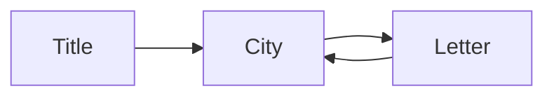

# Design: Folded Light Brews

Back to [[Folded Light Brews]].

## Systems and economy

Assumptions:
- Primary kind is Narrative; Expression is the second target kind.

### Systems
| System | Purpose | Serves (kinds) | Inputs | Outputs |
|---|---|---|---|---|
| Sunbeam catching | The core verb: catch drifting light in a cup | Narrative, Expression | Sunbeams, cups | Light, themed beams |
| Brewing | Combine a beam and a letter theme into a named story | Expression | Themed beam, letter theme | Named brew |
| Unfolding | Spend light to open the next letter segment | Narrative | Light | Story text, new streets |
| City shelf | Place brews on streets so the city reads as yours | Expression, Narrative | Named brews | City layout, new themes |

Cut or redesigned:
- None

### Resources
| Resource | Sources | Sinks | Cap | Why it exists (kind) |
|---|---|---|---|---|
| Light | Sunbeam catching | Unfolding, brewing | 30 | Narrative: every reveal costs a choice |
| Letter themes | Unfolding | Brewing | 5 held | Expression: themes flavor each brew |
| Named brews | Brewing | City shelf | 12 on shelf | Expression: the collection says who you are |

### Balance levers
- Beam rate → how fast light arrives → 1 beam per 8 seconds
- Unfold cost → how often the story advances → 6 light per segment
- Light cap → how long the player can hoard → 30

### First hour in numbers
| Minute | Player state | Key resources | What changes |
|---|---|---|---|
| 0 | First cup in hand | Light 0 | Beams start to drift past |
| 5 | Caught 30 beams | Light 24 | First unfold is affordable |
| 20 | 3 segments open | Light 10, themes 2 | Brewing unlocks |
| 60 | 8 segments open | Light 18, brews 6 | Second street unfolds |

### Failure and recovery
- The player cannot lose. Hoarding at the cap wastes beams; a dimming cup shows the waste, and the next unfold empties the cup.

```json
{"section": "systems-economy", "systems": 4, "resources": 3, "unserved": []}
```

## Progression and content

### Game length
- 4 hours. Librande: decide the length up front. Twelve letter segments at about 20 minutes each finish the authored story.

### Session plan
| Session | Goal | New element | Target kind |
|---|---|---|---|
| 1 | Open the first letter | Catching and unfolding | Narrative |
| 2 | Name the first brew | Brewing | Expression |
| 3 | Fill the first street | City shelf | Expression |
| 4 | Finish the first letter | Branching segment | Narrative |

### Unlock curve
| Unlock | When (session or minute) | Why then |
|---|---|---|
| Brewing | Minute 20 | The player has seen 3 themes to combine |
| Second street | Session 3 | The shelf is full |
| Branch choice | Session 4 | The player knows the characters |

### Timed storyboard
| Time | Panel |
|---|---|
| 0:00 | A beam drifts past; the first cup |
| 0:20 | First letter segment unfolds |
| 0:40 | First named brew |
| 1:30 | First street complete |
| 2:30 | A letter branches |
| 4:00 | The last letter closes; the city is yours |

### Content inventory
| Asset type | Count | Solo-dev cost (hours) |
|---|---|---|
| Letter segments | 12 | 24 |
| Themes | 5 | 5 |
| Street tiles | 10 | 15 |

```json
{"section": "progression-content", "length_hours": 4, "sessions": 4, "content_hours": 44}
```

## Levels and UX

### First 10 minutes
| Time | Player does | Player learns | Target kind |
|---|---|---|---|
| 0:00 | Taps a drifting beam | Beams can be caught | Narrative |
| 2:00 | Unfolds a segment | Light buys story | Narrative |
| 6:00 | Names a brew | Brews are theirs | Expression |

### Sample levels
#### Level 1: The Post Office
- Goal: open the first letter.
- New element: unfolding.
- Difficulty: 1
- Target kind: Narrative

```text
[cup] -> [counter] -> [letter]
```

#### Level 2: Paper Lane
- Goal: shelve 3 brews.
- New element: city shelf.
- Difficulty: 2
- Target kind: Expression

```text
[shelf][shelf][shelf]
```

#### Level 3: The Crossing
- Goal: choose a branch.
- New element: branching segment.
- Difficulty: 3
- Target kind: Narrative

```text
[letter] -> [left] / [right]
```

### Controls
| Input | Action |
|---|---|
| Keyboard/mouse: click | Catch a beam |
| Controller: A | Catch a beam |
| Touch: tap | Catch a beam |

### HUD
- Light count, top left.

### Screen flow


```json
{"section": "level-ux", "levels": 3, "first10_rows": 3}
```

## Prototype and playtest plan

### Milestones
| Milestone | Proves | Scope | Duration | Exit criteria |
|---|---|---|---|---|
| Paper prototype | Spending light pulls the player on | Cards and tokens | 1 day | 4 of 5 testers ask for one more letter |
| Grey-box | Catching feels good | One screen | 1 week | Testers catch for 3 minutes unprompted |
| Vertical slice | Brews feel personal | One street | 3 weeks | Testers describe their shelf as theirs |

### Playtest questions
- **Narrative**: Do you want to open one more letter, and why?
- **Expression**: Would you show someone your shelf?

### Success metrics
- 4 of 5 testers open a second letter without a prompt.

### Tech notes
- Godot 4: free, small 2D footprint, one developer can ship to desktop and web.

### Risks retired
| Risk | Milestone that retires it |
|---|---|
| Unfolding feels like a menu | Paper prototype |

```json
{"section": "prototype-plan", "milestones": 3, "questions_by_kind": {"Narrative": 1, "Expression": 1}}
```
