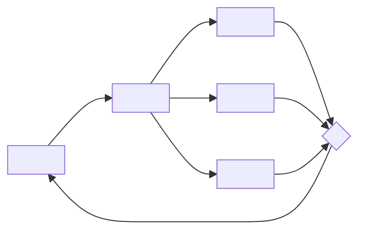
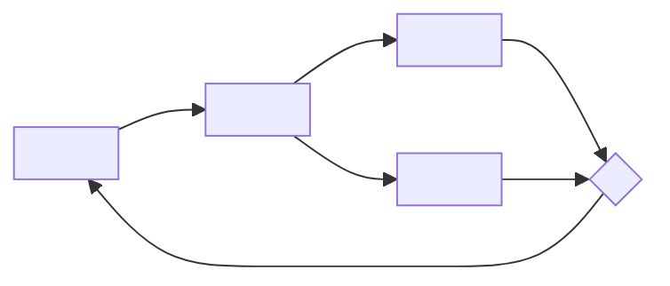
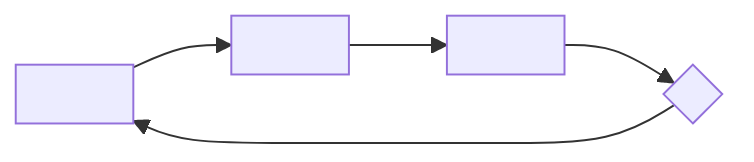

# Core Loop

You draw the game as loops before anything else. A loop that closes is a game; a loop with a gap
is a bug in the design.

Read `references/loops.md` before you start.

## Input

A concept (title and one-liner, or a brief) and, ideally, the `fun-targeting` result: the blend,
the 2–3 target kinds of fun (the first is the **primary**) and the mechanics. Everything else is
optional.

## Rules

- Never ask the user a question. Infer what is missing and write it under **Assumptions**.
- If the target kinds of fun are not given, pick 2–3 from the concept and say so under Assumptions.
- The **primary** kind is the one the caller names as primary; otherwise the first target kind.
- Draw exactly **3** loops: moment-to-moment, session, long-term. One Mermaid block per loop.
- Every Mermaid block starts with `flowchart LR`.
- Name the nodes with these id prefixes, so the four steps are visible:
  - `A` = player action (rectangle), for example `A1["Place a tile"]`
  - `S` = system response (rectangle)
  - `F` = feedback (rectangle)
  - `D` = next decision (diamond), for example `D1{"Save or spend?"}`
- Each loop has at least one of each: `A`, `S`, `F`, `D`. The last decision leads back to an action,
  so the loop closes.
- **One feedback node per kind**: in the moment-to-moment and session loops, draw one `F` node for
  each target kind that loop produces: `F1`, `F2`, `F3`, at most 3 per loop. The same system
  response fans out to each `F`, and each `F` leads to the same decision. Put the primary on `F1` of
  the moment-to-moment loop. The long-term loop keeps one `F` node.
- Number the nodes from 1 in each Mermaid block (`A1`, `S1`, `F1`, `D1`), because each block is a
  separate graph.
- **Every edge that leaves an `F` node has a label**: exactly one kind of fun name and nothing
  else, for example `F1 -->|Challenge| D1`. Use only the eight names: Sensation, Fantasy,
  Narrative, Challenge, Fellowship, Discovery, Expression, Submission.
- Put all node text in double quotes. Do not use parentheses or quotes inside node text.
- Label feedback with a target kind wherever you can. A feedback edge labeled with a non-target
  kind goes into **Gaps**.
- **Fold-in rule**: the primary kind labels at least 1 edge of the moment-to-moment loop. Every
  target kind labels at least 1 edge of the moment-to-moment or session loop. A kind that only
  the long-term loop produces is bolted on: redesign the inner loops (change an action, a system
  response or a feedback) until the rule holds. Never label a feedback with a kind it does not
  produce just to pass.

## Steps

1. Name the core verb and the target kinds of fun.
2. Draw the moment-to-moment loop (seconds): the core verb, the rule it triggers, one feedback per
   target kind the verb produces, the next small choice.
3. Draw the session loop (one sitting): the session goal, how the game resolves it, one reward per
   target kind the sitting produces, the choice that ends or extends the sitting.
4. Draw the long-term loop (days): what carries over, how it changes the next session, why the
   player returns.
5. Write the nesting: what the inner loop feeds into the outer loop.
6. List the gaps: missing steps, feedback that serves no target kind, a decision with only one
   real option.
7. Check the fold-in rule. If it fails, redesign the inner loops and redraw them.
8. Write the output in the exact format below. End with the one-line fold-in self-check.

## Output format

Write exactly these sections, in this order, with these headings:

````markdown
## Assumptions
- <one line per inferred fact; "None" if nothing was inferred>

## Moment-to-moment loop
<one sentence: what the player does every few seconds>



## Session loop
<one sentence>



## Long-term loop
<one sentence>



Draw only the `F` nodes a loop needs: 1 to 3 in the moment-to-moment and session loops, each with a
different kind, and exactly 1 in the long-term loop.

## Nesting
- Moment-to-moment → session: <what the inner loop produces for the outer one>
- Session → long-term: <what carries over>

## Feedback-to-fun map
| Loop | Feedback | Kind of fun | Target? |
|---|---|---|---|
| Moment-to-moment | <feedback> | <Kind> | yes / no |

## Gaps
- <one line per gap; "None" if the loops close and every feedback serves a target>

**Fold-in check:** primary <Kind> on a moment-to-moment edge: yes. Every target kind on a moment-to-moment or session edge: yes (<Kind>: moment-to-moment F1; <Kind>: moment-to-moment F2; <Kind>: session F1).
````

The self-check is the last line of the output. It says `yes` twice, because you redesign the loops
until both parts hold. The parentheses list every target kind once, in target order, with the loop
and the `F` node whose edge carries it.

## Next step

Hand the loops to `design-diagrams` and `game-brief`. For critique, send the design to
`game:game-studio-cpo`.
