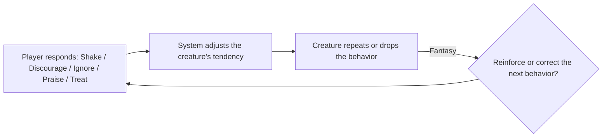

# Loops: flowchart first

Source: Stone Librande, "One-Page Designs", GDC 2010. Librande's advice is to draw the flowchart
first: every game has an engine loop, and the loop is the design's backbone. Kinds of fun are
from Marc LeBlanc, "8 Kinds of Fun" (8kindsoffun.com).

## The engine loop

Every loop has four steps and returns to the start:

1. **Player action**: what the player does (a verb).
2. **System response**: what the game's rules do with that action.
3. **Feedback**: what the player sees, hears or feels as a result.
4. **Next decision**: the choice the feedback sets up. It leads to the next action.

If a step is missing, the loop is broken:
- no system response → the action does nothing;
- no feedback → the player cannot learn;
- no next decision → the loop is a chore, not a game.

## Librande's example: creature training

Librande shows a creature-training loop. The creature does something. The player chooses one of
five responses: **Shake**, **Discourage**, **Ignore**, **Praise** or **Treat**. The system adjusts
the creature's tendency to repeat the behavior. The creature's next behavior is the feedback, and
it sets up the player's next choice of response.

The drawing shows the whole design at once: five inputs, one hidden variable, one visible
output. That is why it fits on one page.

## Three time scales

| Loop | Time scale | Typical question |
|---|---|---|
| **Moment-to-moment** | seconds | What does the player do with their hands right now? |
| **Session** | one sitting (minutes) | What goal does one sitting reach, and what does it leave open? |
| **Long-term** | days to weeks | Why does the player come back tomorrow? |

The moment-to-moment loop runs inside the session loop; the session loop runs inside the
long-term loop. The output of an inner loop is the input of the outer loop (for example, coins
earned per move buy upgrades per session).

## Labeling feedback with fun

Label every edge that leaves a feedback node with the one kind of fun that feedback serves
(Sensation, Fantasy, Narrative, Challenge, Fellowship, Discovery, Expression or Submission).
A feedback that serves none of the target kinds is a candidate to cut.
