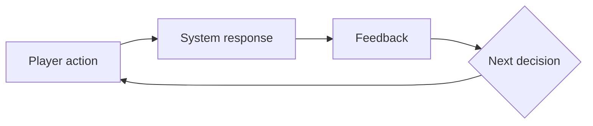
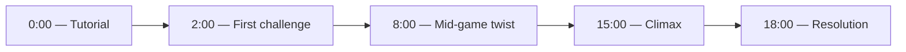
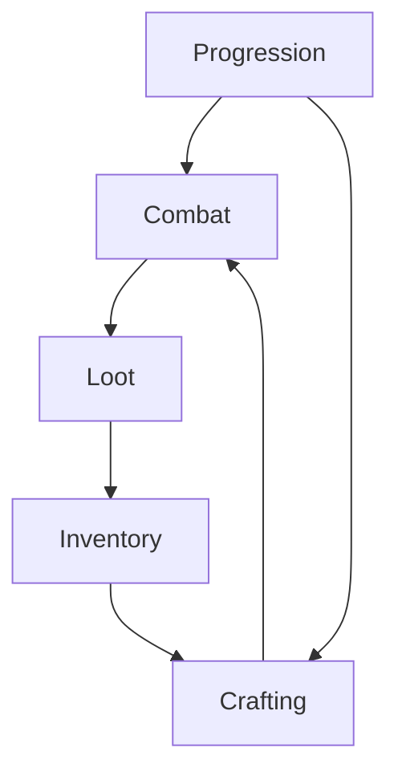

# Diagram catalog

Source: Stone Librande, "One-Page Designs", GDC 2010 (52-minute talk, slides and transcript).
Marc LeBlanc's MDA framework is used only to name which mechanic feeds which target aesthetic;
the diagram vocabulary itself is Librande's.

For each diagram: **when to use**, **when not to**, and a **recipe**.

---

## 1. Flowchart (engine loop)

**When to use.** Every game has an engine loop: player action → system response → feedback →
next decision. Use this for the moment-to-moment loop, a single system's cycle, or an AI's
decision cycle.

**When not to.** Do not use a flowchart for something that has no repeating cycle (a one-time
storyboard) or for a relationship between peers that isn't sequential (use the triangle or matrix
instead).

**Recipe (Mermaid, renders natively in Obsidian):**



Example (Librande's creature-training loop): `Shake / Discourage / Ignore / Praise / Treat` as
five parallel edges from the decision node back into the loop.

---

## 2. Timed whole-game storyboard

**When to use.** Showing where the player should be, and when, across the entire play session or
campaign. Works for executives and for marketing as well as for the design team, because it reads
as a timeline, not a spec.

**When not to.** Do not use this for a single system's internal logic — that's a flowchart. Don't
use it if the game has no meaningful beginning-to-end arc (an endless/sandbox game may need a
different diagram, such as the module map, instead).

**Recipe (Mermaid):**



Label every node with an elapsed-time mark, not just a scene name — the timing is the content.

---

## 3. Time-and-space map (Minard / Spore technique)

**When to use.** Something that changes across both time (or narrative progress) and space (or a
second quantity such as difficulty, scale or brain-level) at once. Minard's chart of Napoleon's
march is the canonical example: space, time and army size together on one sheet. Librande's Spore
creature map plots challenge rising across a continent, with time and brain-level on the bottom
axis. Decide the game's length up front by drawing this, instead of discovering it after the fact.

**When not to.** Don't use it if only one axis actually varies — that's a simpler chart or a
storyboard. Don't use it for a relationship between a fixed small set of things — that's the
triangle or matrix.

**Recipe (JSON/SVG template):** two labeled axes, a path or a series of points along them.

```json
{
  "diagram": "time-space-map",
  "x_axis": { "label": "Time / narrative progress", "unit": "minutes" },
  "y_axis": { "label": "Challenge", "unit": "difficulty tier" },
  "points": [
    { "x": 0, "y": 1, "note": "Tutorial area" },
    { "x": 10, "y": 3, "note": "First real threat" },
    { "x": 25, "y": 6, "note": "Midpoint spike" },
    { "x": 40, "y": 9, "note": "Final area" }
  ]
}
```

---

## 4. Relationship triangle (sides, not corners)

**When to use.** A small set (typically 3) of mutually-opposing forces, such as factions or
classes in a rock-paper-scissors relationship. Put each faction along a *side* of the triangle,
not at a *corner*. Sides become tunable sliders between the two forces they connect, which turns
a fixed counter-relationship into a continuous design space and gives players more expression.

**When not to.** Don't use a triangle for more than 3-4 mutually-opposing forces — use a matrix
instead once the count grows, since a triangle's sides stop being legible past a handful of
forces.

**Recipe (JSON/SVG template):**

```json
{
  "diagram": "relationship-triangle",
  "vertices": ["Speed", "Power", "Range"],
  "sides": [
    { "between": ["Speed", "Power"], "slider_label": "agile <-> heavy" },
    { "between": ["Power", "Range"], "slider_label": "melee <-> ranged" },
    { "between": ["Range", "Speed"], "slider_label": "sniper <-> skirmisher" }
  ]
}
```

---

## 5. Top-down matrix

**When to use.** Two independent axes crossed against each other, such as factions × classes, or
enemy type × terrain. Pick the axes *first*, then fill the grid like a crossword. This also
catches peer-to-peer interaction cases that bottom-up, code-first design misses, because every
cell must be considered even if it ends up empty.

**When not to.** Don't build the grid from whatever content already exists — that produces a
matrix shaped by accident, not by design. If a cell combination is nonsensical for every row or
column, that's a sign the axes are wrong, not that the matrix approach is wrong.

**Recipe (JSON/SVG template):**

```json
{
  "diagram": "matrix",
  "row_axis": { "label": "Faction", "values": ["Sun", "Moon", "Tide"] },
  "col_axis": { "label": "Class", "values": ["Warrior", "Scholar", "Scout"] },
  "cells": {
    "Sun,Warrior": "Solar knight",
    "Sun,Scholar": "Light seer",
    "Sun,Scout": "Dawn runner",
    "Moon,Warrior": "Umbral guard",
    "Moon,Scholar": "Dream reader",
    "Moon,Scout": "Nightwalker",
    "Tide,Warrior": "Wave breaker",
    "Tide,Scholar": "Currentkeeper",
    "Tide,Scout": "Tidewalker"
  }
}
```

---

## 6. Module map

**When to use.** Showing how systems or content modules connect across the whole game — the
"exploded engine cutaway" view. Good for onboarding a new team member or for spotting a system
with too many incoming dependencies.

**When not to.** Don't use it for timing or sequence — that's the storyboard. Don't use it for a
single system's internal loop — that's the flowchart.

**Recipe (Mermaid):**



---

## The "wrong metaphor" check

Before delivering any diagram, ask:

1. Does the shape fold or hide a relationship it should show? Librande's Spore "dreamcatcher" was
   a pretty circle that folded a one-dimensional continuum and placed opposites next to each
   other — visually pleasant, but the wrong metaphor. Keep redrawing until the true shape shows.
2. Is a hierarchy drawn as a loop, or a loop drawn as a hierarchy? Fix the diagram type, not the
   labels.
3. Does an axis exist that is never labeled? Label it or remove it.
4. Does a high-dimensional table (3+ crossed axes) actually reduce to a much smaller number of
   real, distinct outcomes? Spore's consequence system was nominally 4-dimensional (256
   combinations) but collapsed to a vector sum with about 36 real outcomes once the true shape was
   found. Look for that collapse before committing to the biggest possible matrix.
