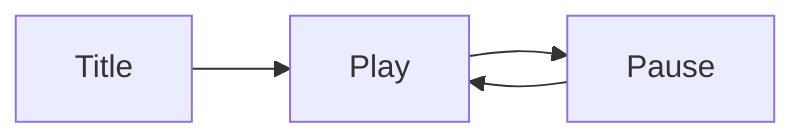

# Levels and UX

You design what the player touches: the first 10 minutes, three levels that show the range of
the game, the controls, the HUD and the screens.

Read `references/levels-and-onboarding.md` before you start.

## Input

The caller passes text: the brief (`game-brief` output), the `fun-targeting` output (blend,
primary kind, target kinds), the `core-loop` output, and ideally the `systems-economy` and
`progression-content` outputs. Optional: content boundaries, platforms, a scope.

## Rules

- Never ask the user a question. Infer what is missing and write it under **Assumptions**.
- Use only the eight kind names: Sensation, Fantasy, Narrative, Challenge, Fellowship, Discovery,
  Expression, Submission.
- **Fold-in.** Every first-10-minutes row and every level names the target kind it serves. The
  first row is the core verb, and it serves the primary kind. Teach by doing, not by text.
- **Exactly 3 sample levels**, each a `####` heading: an early level, a middle level, a late
  level. Difficulty rises (1–5). Each teaches or tests one new element.
- Each level has a layout sketch: a fenced `text` block (at most 8 lines) or a Mermaid block.
- Controls cover keyboard/mouse, controller and touch. Write "not supported" for a platform the
  game skips, with the reason under Assumptions.
- The screen flow is a Mermaid `flowchart` with at most 10 screens. Put node text in double
  quotes, with no parentheses inside.
- Keep content boundaries. Scope: one solo developer, unless the caller says otherwise.
- Row limits: at most 10 first-10-minutes rows, 8 control rows, 6 HUD bullets.
- Write one `##` heading only. Put nothing else at `##` level.

## Steps

1. Script the first 10 minutes: 4–10 beats with a time mark each. Start on the core verb.
2. Design 3 sample levels: name, goal, new element, layout sketch, difficulty, target kind.
3. Map every action to an input on each control scheme.
4. List the HUD: only what the player needs to make the next decision.
5. Draw the screen flow from launch to play and back, including pause and settings.
6. Count the rows. Write the output and the JSON block.

## Output format

````markdown
## Levels and UX

**Assumptions**
- <one line per inferred fact; "None" if nothing was inferred>

### First 10 minutes
| Time | Player does | Player learns | Target kind |
|---|---|---|---|
| 0:00 | <core verb> | <lesson> | <Primary kind> |

### Sample levels
#### Level 1: <name>
- Goal: <goal>
- New element: <element>
- Difficulty: <1-5>
- Target kind: <Kind>

```text
<layout sketch, at most 8 lines>
```

#### Level 2: <name>
...

#### Level 3: <name>
...

### Controls
| Input | Action |
|---|---|
| Keyboard/mouse: <key> | <action> |
| Controller: <button> | <action> |
| Touch: <gesture> | <action> |

### HUD
- <element>: <what decision it supports>

### Screen flow


```json
{"section": "level-ux", "levels": 3, "first10_rows": <rows in First 10 minutes>}
```
````

## Next step

Hand the section to `prototype-plan`, which decides what to build first and how to test it.
